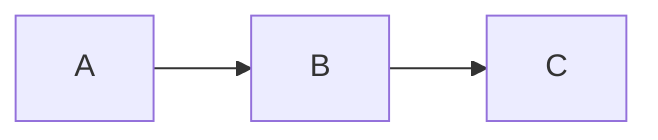
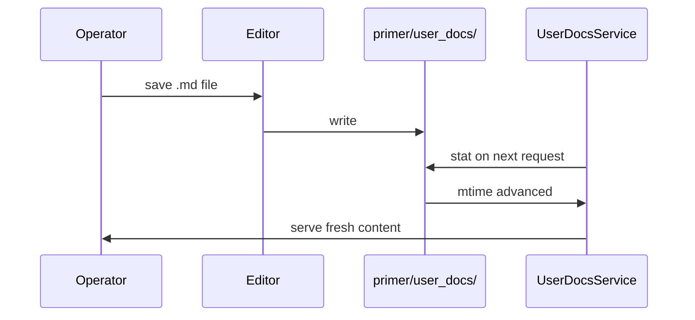

## Where docs live

Operator-facing docs live under `primer/user_docs/<section>/<slug>.md`.
The five visible sections are listed in `primer/user_docs/manifest.yaml`;
the manifest also controls ordering and visible-doc membership.
Docs on disk but absent from the manifest are reachable by direct
slug but hidden from the left nav.

## The lint

The doc service runs the lint after every reload. In dev mode
(env var `PRIMER_USER_DOCS_STRICT=1`) lint errors block startup.
In production they log loudly and the offending doc is excluded
from the manifest. Highlights:

- The em-dash character is rejected anywhere in a doc source. Use
  the regular hyphen, the double-hyphen, or rework the sentence.
- Every `ref:<slug>` and `ai-doc:<slug>` resolves at lint time.
- Every `embed:<id>` is checked against the embed registry
  (`primer/user_docs/_fixtures/registry.json`).
- Required frontmatter keys: slug, title, summary, section.
  Cookbook docs also require difficulty, time_minutes, tags.

## The six directives

### callout

```callout:info
This is what the info kind looks like in real prose.
```

Severity variants: `info`, `warning`, `danger`, `tip`.

### ref

```ref:features/agents
Links to another doc by slug.
```

### ai-doc

```ai-doc:agents
```

### code-tabs

```code-tabs:python,curl
--- python
print("hello")
--- curl
curl https://example/v1/hello
```

### mermaid



### embed

Renders a real console component from the embed registry with fixtures.
The id must match an entry in `primer/user_docs/_fixtures/registry.json`.
The component is rendered inside an iframe using live fixture data --
no hand-drawn JSX required.

```embed:agents-page
```

Valid embed ids are listed in the registry. An unregistered id is
a lint error (`unknown_embed_id`).

## A small architecture sketch



## Adding a new directive

The directive registry lives in `ui/vendor/markdown.jsx`. Each
directive registers a handler via `window.MarkdownDirectives.register`.
The handler receives the body and returns a React node.

## Adding a new embed

1. Add the fixture JSON under `primer/user_docs/_fixtures/<id>.json`.
2. Register the id in `primer/user_docs/_fixtures/registry.json`.
3. Implement the component in `ui/components/docs/directives-embed.jsx`
   (or a dedicated file loaded before it).
4. Use `embed:<id>` in the doc body. The lint will verify the id on
   next reload.
