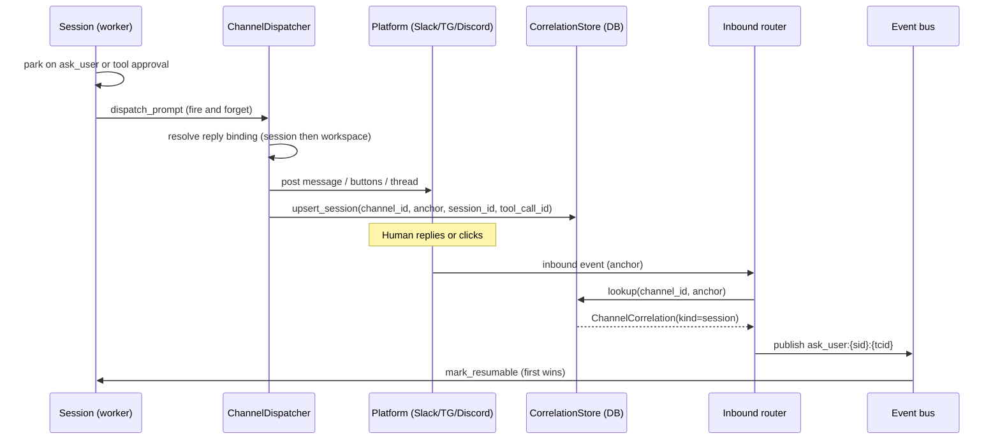

## What a reply binding is

A **reply binding** answers one question: when a workspace session sends something a human should see (a question, an approval prompt, an `inform` message, a start acknowledgement, the final result), which channel and thread does it post to?

A reply binding resolves by precedence, most specific first:

1. **Session-scoped binding.** Set by an inbound channel rule's reply target when a channel event spawns the session, anchored to the originating thread. This is why a channel-triggered session feels conversational.
2. **Workspace-standing binding.** The `Workspace.reply_binding` link, anchored to the channel's default room. This is the standing destination for every session that runs in the workspace.
3. **None.** With no binding, gates park silently and `inform` is a no-op, exactly as before.

This page covers the workspace-standing binding. The session-scoped override is set by a rule's reply target.

Key properties:

- **One channel per workspace.** A workspace has at most one standing reply binding. Replace it by setting a new one; clear it with a DELETE.
- **Full lifecycle.** When a binding exists, the session auto-posts a start acknowledgement, forwards `ask_user`, tool approvals, and `inform`, and posts its final result. A per-binding quiet mode can suppress the acks while still forwarding gates.
- **Mutable at any time.** Set or clear it without stopping running sessions. New dispatches use the new value; in-flight gates are unaffected.
- **Correlation survives restarts.** Primer writes a `ChannelCorrelation` row for each gate it dispatches, mapping the platform thread (or Telegram gate message) to the specific session and tool-call id. If the API restarts between dispatch and reply, the row is still there and the inbound reply routes correctly.

## Inbound and outbound flow



The dispatch is fire-and-forget: the worker schedules it as a background task after parking so a slow platform post never delays releasing the session's compute lease.

The anchor identifies the conversation thread (a Slack thread timestamp, a Discord message id, or a Telegram gate-message id). The `ChannelCorrelation` row keyed on `(channel_id, anchor)` is what connects the platform reply back to the right session. The unique index on `(channel_id, anchor)` plus an atomic upsert means two workers racing to dispatch the same gate write exactly one correlation row, preventing double-resume.

## Attribution header

Every gate post includes a one-line attribution header showing which workspace and session the prompt came from:

```
Workspace: blog-assistant / Session: sess-abc123
[agent's ask_user prompt text]
```

This lets a channel that serves multiple workspaces and sessions stay organised. The header is omitted when neither a workspace name nor a session label is available.

## Configuration

The standing binding is a field on the workspace row. No separate entity is created.

| Field | Notes |
|---|---|
| `channel_id` | The id of the Channel to forward session traffic to. Must refer to a channel that exists. |

A workspace has its `reply_binding` cleared (null) by default. Setting it via PUT activates forwarding immediately; DELETE clears it.

## Walkthrough: bind a workspace to a channel

**Via the console:**

1. Open **Workspaces** in the sidebar and select the workspace you want to configure.
2. Find the **Reply binding** section in the workspace detail panel.
3. Click **Set channel**.
4. Choose the channel from the dropdown. Only channels with a provider configured appear in the list.
5. Click **Save**. The workspace detail page now shows the bound channel name.

**Via the REST API:**

```
PUT /v1/workspaces/{workspace_id}/reply_binding
Content-Type: application/json

{"channel_id": "channel-abc123"}
```

To clear the binding:

```
DELETE /v1/workspaces/{workspace_id}/reply_binding
```

**Via primectl:**

```
primectl channel binding set <workspace_id> <channel_id>
primectl channel binding clear <workspace_id>
primectl channel binding get <workspace_id>
```

`binding set` issues the `PUT`, `binding clear` the `DELETE`, and `binding get` reads the workspace and prints its current `reply_binding`.

**Via agent tools:** The `system__set_reply_binding` and `system__clear_reply_binding` tools do the same from inside a session, letting an agent configure its own workspace's channel routing programmatically.

## Allowed agents and the chat surface

The `allowed_agents` and `allow_agent_switch` settings live on the channel's chat config, not on the reply binding. If the channel has chat enabled:

- `allow_agent_switch: false` (default): users cannot run `/agent` to change which agent handles their chat.
- `allow_agent_switch: true`: users may run `/agent`; the picker shows all agents unless `allowed_agents` is set.
- `allowed_agents: ["agent-id-1", "agent-id-2"]`: restricts the `/agent` picker to the listed agents (and requires `default_agent` to be in the list).

These settings are on the channel itself, not on the binding, because they describe what is allowed for that room regardless of which workspace sessions are currently forwarding to it.

```ref:channels/channels
Channel rooms, chat config, and in-channel commands.
```

```ref:channels/channel-rules
Map inbound events to actions and set a per-session reply target.
```

```ref:channels/channel-providers
Platform credentials and provider setup.
```

```ref:workspaces/workspace-providers
Workspace provider types and creating workspaces.
```

```ref:workspaces/yielding-tools
How ask_user and tool approval gates park and resume a session.
```
