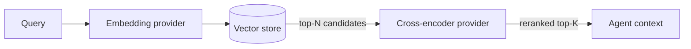

## Concept

A cross-encoder is a model that scores a (query, document) pair together rather than encoding them separately. This is different from an embedding model, which encodes query and document independently and then compares vectors. The cross-encoder reads both texts at once, letting them attend to each other, and returns a single relevance score. That score is more accurate than a cosine similarity between independent embeddings, but it is also more expensive to compute, so it is used as a reranking step rather than a first-pass retrieval step.

The typical pipeline looks like this:



1. The embedding provider encodes the query and the vector store returns the top-N nearest-neighbor chunks (fast, approximate retrieval).
2. The cross-encoder scores each (query, chunk) pair and reorders them. Only the top-K highest-scoring chunks are injected into the agent's context.

This two-stage approach keeps retrieval fast while using the cross-encoder's superior accuracy for the final ranking. The collection UI exposes a **cross-encoder reranker** (CER) toggle and top-K control that wire directly to this provider.

One cross-encoder provider type ships today:

- **huggingface**: local inference via `sentence-transformers` `CrossEncoder` class. The model runs inside the primer process using `asyncio.to_thread` to avoid blocking the event loop during weight loading or inference. No outbound API call. A reserved provider row (id `huggingface-ce`) is auto-created on first boot for public Hub models that need no token.

```callout:info
Only one cross-encoder backend is available today. Future provider types (remote reranker APIs) will follow the same provider-pattern and appear here when added.
```

## Configuration

Every cross-encoder provider row has these fields:

### Provider type

Currently only `huggingface`.

### Provider ID

A unique handle such as `hf-ce-bge`. Collections reference this ID when CER is enabled.

### Connection fields

**huggingface**
- `token`: optional HuggingFace token. Only required if the model is in a gated repository. Public reranker models such as `BAAI/bge-reranker-v2-m3` and models in the `cross-encoder/*` family do not need a token. The auto-bootstrapped `huggingface-ce` row has no token.

### Models

A list of cross-encoder model identifiers. Each entry has:

- `name`: the provider-side model slug (e.g. `BAAI/bge-reranker-v2-m3`, `cross-encoder/ms-marco-MiniLM-L-6-v2`).
- `max_pair_length`: optional cap on the combined (query + document) token length per pair. Leave unset to defer to the model's own default. Set this if you need predictable truncation behavior on very long chunks.

### Limits

- `max_concurrency`: maximum number of in-flight reranking batches at once. Cross-encoder inference is CPU-intensive (or GPU-intensive if available). Start low (e.g. `2`) on modest hardware and increase if throughput allows. Required; no default.
- `request_timeout_seconds`: per-event inactivity timeout (default: `300`). For a local HuggingFace model this guards against runaway inference on very large batches. Set to `null` to disable.

## Walkthrough

The following steps add a cross-encoder provider for the `BAAI/bge-reranker-v2-m3` model.

1. Go to **Providers** in the left navigation and open the **Cross-encoder** tab.
2. Click **Add provider**.
3. Set **Provider type** to `huggingface`.
4. Enter a provider ID such as `hf-ce-bge`.
5. Leave `token` blank (this is a public model on the Hub).
6. Click **Add model** and enter `BAAI/bge-reranker-v2-m3`.
7. Leave `max_pair_length` unset to use the model's own default.
8. Set `max_concurrency` to `2` as a starting point.
9. Click **Save**.

```embed:cross-encoder-provider
```

After saving, go to a collection and enable the **Cross-encoder reranker** toggle in the collection settings. Select the provider you just created and choose the top-K value (how many chunks to pass to the agent after reranking).

```callout:tip
The built-in `huggingface-ce` provider row is created automatically on first boot. If it already carries the model you want, you can use it directly without adding a new row.
```


```ref:embedding/semantic-search-providers
The vector store backend that the cross-encoder reranks results from.
```

```ref:embedding/collections-and-documents
How to enable the cross-encoder reranker toggle on a collection.
```
