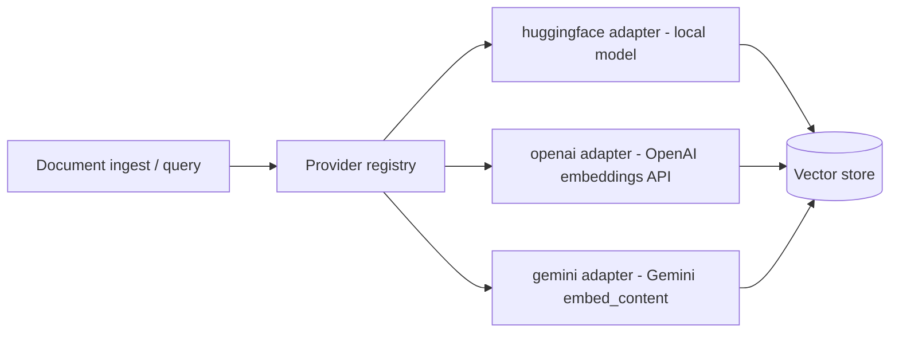

## Concept

An embedding provider converts a piece of text into a dense numeric vector. Primer uses these vectors to store and search documents in knowledge collections and in the internal collections subsystem. When you create a collection, you pick which embedding provider backs it; all documents ingested into that collection are encoded by that provider, and all queries against it are encoded the same way before the vector search runs.

The choice of provider determines:

- **Dimensionality**: the length of the vector each model produces. Primer learns this automatically from the first chunk ingested rather than requiring you to declare it.
- **Model family semantics**: some model families (BGE, E5, nomic-embed-text) expect different prefixes on query text versus document text (asymmetric retrieval). The HuggingFace adapter handles this automatically.
- **Hosting**: HuggingFace runs the model locally inside the primer process (no external API call). OpenAI and Gemini call a remote API.

Three embedding provider types ship today:

- **huggingface**: local inference via `sentence-transformers`. No outbound API call; models are downloaded from the HuggingFace Hub on first use. A `huggingface` provider row (id `huggingface`) is auto-created on first boot with an empty token, so public Hub models work out of the box with no configuration.
- **openai**: the OpenAI embeddings API, or any OpenAI-compatible embedding endpoint (LM Studio, and others via the `flavor` field).
- **gemini**: the Gemini embedding API via Google AI Studio.



## Configuration

Every embedding provider row has these fields:

### Provider type

Selects the backend: `huggingface`, `openai`, or `gemini`.

### Provider ID

A unique handle such as `hf-local` or `openai-embed`. Collections reference this ID when selecting an embedding backend.

### Connection fields (per type)

**huggingface**
- `token`: HuggingFace token used to pull transformer model weights. Required at the schema level, but the auto-bootstrapped `huggingface` row seeds it with an empty string, which maps to `token=None` on the `SentenceTransformer` call. This is correct for public Hub models. Only set a real token if the model you want is in a gated repository.

**openai**
- `url`: base URL of the embedding endpoint (e.g. `https://api.openai.com`).
- `api_key`: bearer token. Optional for endpoints that do not require authentication (LM Studio by default).
- `flavor`: server variant: `openai` (real OpenAI, requires a non-empty key), `lmstudio` (tolerates empty key), or `other` (conservative, treats missing key as an error). Defaults to `other`.

**gemini**
- `api_key`: Gemini API key from Google AI Studio. Optional when fronted by a proxy that supplies auth.

### Models

A list of embedding model identifiers the provider is allowed to serve. Each entry has:

- `name`: the provider-side model slug (e.g. `text-embedding-3-small`, `all-MiniLM-L6-v2`, `models/text-embedding-004`).

Vector dimensionality is not declared here; primer measures it from the first real embedding produced during ingestion and stores it on the collection.

### Limits

- `max_concurrency`: maximum number of in-flight embedding requests at once. This applies equally to ingest (bulk chunking) and to query-time encoding. Required; choose a value that fits your API tier.
- `request_timeout_seconds`: per-event inactivity timeout (default: `300`). Applies to the remote API call for OpenAI and Gemini. The HuggingFace adapter runs locally so the timeout still applies but stalls are less common. Set to `null` to disable.

## Walkthrough

The following steps add a HuggingFace embedding provider for a specific model. Steps for OpenAI and Gemini differ only in the connection fields.

1. Go to **Providers** in the left navigation and open the **Embedding** tab.
2. Click **Add provider**.
3. Set **Provider type** to `huggingface`.
4. Enter a provider ID such as `hf-bge`.
5. For a public model, leave `token` blank. For a gated model, paste your HuggingFace token.
6. Click **Add model** and type the model name, for example `BAAI/bge-small-en-v1.5`.
7. Set `max_concurrency` to `4` as a starting point for local inference on modest hardware.
8. Leave `request_timeout_seconds` at `300`.
9. Click **Save**.

When you later create a collection and choose this provider, the model weights are downloaded from the Hub on first ingest and cached locally.

```embed:embedding-provider
```

```callout:info
The built-in `huggingface` provider row (id `huggingface`) is created automatically on first boot. You can use it directly without adding a new row, or add separate rows if you want to register different models with different concurrency limits.
```


```ref:embedding/semantic-search-providers
The vector store backend that receives the embeddings.
```

```ref:embedding/collections-and-documents
How to create a collection backed by an embedding provider and ingest documents into it.
```
