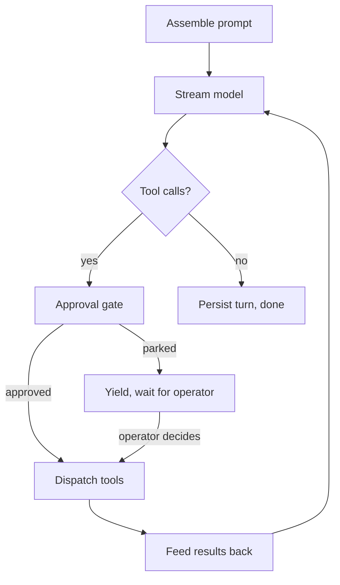

## What an agent is

An agent is a reusable definition that tells primer how to drive an LLM on your behalf. It has three core parts:

- **Model binding**: which LLM provider and model to use.
- **System prompt**: the fixed instruction block prepended to every turn.
- **Tool allowlist**: the specific tools the agent may call, chosen from the available toolsets and MCP servers.

Two optional settings tune its behavior:

- **Temperature**: overrides the model's output randomness for this agent. Leave it unset to use the provider's default.
- **Compaction prompt**: custom instructions for how the conversation is summarized when it nears the model's context window. Leave it unset to use the framework default.

The definition is stateless. The conversation transcript, the workspace filesystem the agent reads and writes, the channel it replies into: all of that lives elsewhere. Multiple chats, sessions, or graph nodes can invoke the same agent simultaneously without sharing memory.

```callout:tip
Think of an agent as a function signature. Chats, sessions, and graph nodes are the call sites. The state lives in the call site, not the function.
```

### The turn loop

When an agent is invoked, primer runs a turn loop:

1. Assemble the full prompt from the system prompt plus conversation history.
2. Stream the model until it stops.
3. If the model produced tool calls, route each through the approval gate.
4. Dispatch approved calls; feed the results back as tool-result messages.
5. Return to step 2.
6. When the model produces a final response with no pending tool calls, the turn ends and the result is persisted.



Context grows with every round-trip. When it approaches the model's context limit, primer automatically compacts the oldest turns into a summary message so the agent can keep working without losing its broader intent.

### How agents relate to chats and sessions

| Concept | What it is |
|---|---|
| Agent | A reusable definition: model + prompt + tools |
| Chat | An interactive, multi-turn conversation driven by a human |
| Session | A headless, autonomous run of an agent on a workspace |
| Graph | A pipeline that routes between multiple agents |

An agent does nothing on its own. It runs only when a chat, session, graph node, or trigger invokes it with a concrete input and a place to write output.

### Tool routing

Every tool is identified by a scoped name: `toolset_id__tool_name`. The double-underscore separator keeps tool names unambiguous when the agent has access to multiple toolsets, MCP servers, or workspace tools that happen to share bare names.

Before a tool dispatches, the approval gate evaluates any configured policy on that `(toolset_id, tool_name)` pair. By default the gate is a no-op. When a policy is configured, it can let the call through immediately, block it, or park the agent until an operator decides.

## Configuration

The agent create and edit modal has three tabs: **Basic**, **Tools**, and **Advanced**.

### Basic tab

- **ID**: optional. If left blank, the backend assigns a type-prefixed id (for example, `agent-3f9a1c8d`). The id is immutable after creation.
- **Description**: a short label shown in the agents table and used by the internal-collections search index when other agents search for agents by capability.
- **LLM provider**: select from the providers configured under Providers > LLM. If the list is empty, create a provider first.
- **Model**: the dropdown populates from the selected provider.

### Tools tab

The Tools tab shows every tool from every registered toolset and MCP server. Use the search box to filter by name, description, or toolset. Check individual tools or use the toolset header checkbox to bulk-select all tools in a toolset. The counter at the top right shows how many tools are selected.

Only the tools you explicitly check are exposed to the model. You are not binding an entire toolset; you choose the minimum set the agent needs. This matters for two reasons:

- **Scope control**: a large toolset can ship over 100 tools. Binding all of them inflates the model's tool list, increasing token cost per turn and the chance of an unintended call.
- **Emergency deny**: remove a specific tool from the agent's list to deny it immediately without changing the underlying toolset or approval policy.

Two controls compose for layered access:

1. **Tool selection** (this tab): determines which scoped tool ids (`toolset__tool`) are registered with the agent. Nothing outside this list can be called.
2. **Tool approval policies** (Toolsets > Approvals): for calls that should route to a human gate, configure an approval policy on the `(toolset, tool)` pair. The agent still sees the tool in its list but the runtime intercepts the call before dispatch.

```callout:warning
Binding tools from the `system` toolset gives the agent shell and filesystem access through the sandboxed workspace. Pair it with a tight workspace template when prototyping. Relax limits only after validating the prompt and tool-use pattern.
```

### Advanced tab

- **System prompt**: the fixed instruction block sent before every turn. It is sent verbatim, joined across its parts; the runtime does not substitute placeholders into it (a workspace session appends its own fixed fragment, but that is added by the runtime, not templated from your text).

  Keep the system prompt focused on role, output format, and constraints. Pass data that changes per-run through the session input instead of hardcoding it into the prompt.

- **Compaction prompt**: instructions the runtime uses when it compacts the conversation history to fit within the model's context window. Leave blank to use the framework default, which preserves system context, recent turns, and pending tool calls. Override it only when your agent has a domain-specific retention need (for example, a research agent that must preserve cited sources, or a coding agent that must retain the current file path under edit).

- **Temperature**: controls model output randomness. Leave blank to use the provider's default. Set to a low value (0.1 to 0.3) for deterministic extraction or structured output tasks. Use higher values (0.7 to 1.0) for creative or open-ended generation. The valid range and maximum depend on the provider.

## Walkthrough: create your first agent

```embed:agents-page
```

1. Open **Agents** from the left nav.
2. Click **New agent** (top-right of the filter bar).
3. On the **Basic** tab, enter a name in Description and select your LLM provider and model. Leave the ID blank to let the backend generate one.
4. Switch to the **Tools** tab. Search for the tools this agent needs and check them. If the agent is a pure chat agent with no tool use, leave the list empty.
5. Switch to the **Advanced** tab and write a system prompt. One or two sentences describing the agent's role and expected output format is enough to start.
6. Click **Create**. The modal closes and the new agent row appears in the list.

```embed:quickstart-agents
```

## Editing an agent

Open the agent detail, go to the **Config** tab, and click **Edit**. The same three-tab modal opens with existing values pre-filled. The ID field is locked after creation.

Agents managed by a harness show a notice on the Config tab; edit the harness instead of the agent directly.

Sessions started after an edit pick up the new definition. Any session already in flight keeps the old model and tools until it ends.

## Calling other agents and graphs

An agent can invoke other agents and graphs as part of its own turn. Three tools cover the patterns; bind them from the Tools tab.

### `invoke_agent` (run a subagent)

`system__invoke_agent` runs another agent once on a prompt and returns its text. The call is blocking and stateless: the subagent sees its own system prompt plus the prompt you pass, not the caller's conversation, and nothing is persisted as a separate chat or session.

Use it to delegate a self-contained subtask to a specialist and fold the result back into your own reasoning.

| Argument | Meaning |
|---|---|
| `agent_id` | The agent to run |
| `prompt` | The input for the subagent |

The subagent runs with its full `tools` surface, including yielding tools (ask_user, approval gates), and the caller's approval gate is inherited. If a tool yields, the whole nested-invocation chain parks and resumes when the human replies. Nested invocations are capped by a depth limit (default 8, configurable via `PRIMER_MAX_INVOCATION_DEPTH`) so a cycle of agents calling each other cannot recurse forever.

### `switch_to_agent` (hand off the chat)

`system__switch_to_agent` hands the current chat off to another agent and ends the current turn. Unlike `invoke_agent`, it does not return a value: the chat's agent changes and the new agent runs the handoff prompt as the next turn, with the full prior conversation as shared context.

| Argument | Meaning |
|---|---|
| `agent_id` | The agent to hand off to |
| `prompt` | The instruction the new agent runs next |

This is the tool-driven equivalent of the agent dropdown in the chat header. It is chat-only: a workspace session has no single conversation to retarget, so the tool returns an error there.

### `invoke_graph` (run a graph in the session)

`workspace_ext__invoke_graph` runs another graph inside the current workspace session and returns its output. The invoked graph's state nests under the session's state tree.

| Argument | Meaning |
|---|---|
| `graph_id` | The graph to run |
| `input` | The graph input |

`invoke_graph` is a workspace-session tool: it requires a session and is not available in plain chats. It supports full human-in-the-loop: if the invoked graph hits an approval node or an agent that asks the user, the session parks and resumes when the human replies.


```ref:features/chats
Creating chats, the agent switcher, and streaming.
```

```ref:workspaces/workspaces-and-sessions
Starting sessions, lifecycle statuses, and the session detail view.
```

```ref:toolsets/toolsets-system
Toolsets, tool approval policies, and the internal toolsets reference.
```

```ref:reference/api-agents
Full resource schema, list/create/update/delete endpoints, and status check.
```

```ai-doc:agents
```
