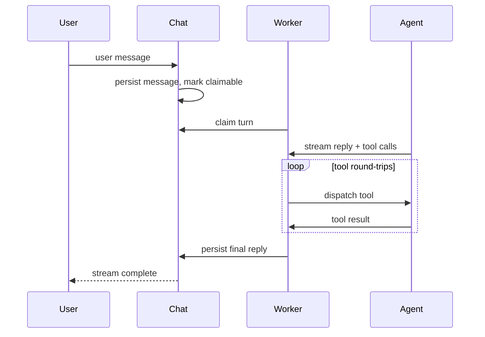

## What a chat is

A chat is an interactive, multi-turn conversation that starts with an agent. You are not locked to that agent: you can switch the active agent at any point (see Switching the agent below), and the full conversation history carries across the switch. A chat is the right surface when a human (or another agent) keeps the loop going turn by turn: you send a message, the agent responds, you reply, and this continues indefinitely on the same persistent message log.

Unlike a session (which runs headless under a scheduler and does work autonomously), a chat waits for the next human message before starting a new turn.

```callout:tip
Pick chat for interactive back-and-forth. Pick session for autonomous, long-running work where the agent should proceed without waiting.
```

### The turn shape

A chat turn starts when a user message arrives and ends when the agent produces a final reply. Between those two events, the agent may call tools zero or more times:



The key design property is **turn detachment**: the user message is persisted to storage the moment it arrives, and a background worker claims the turn independently. The connection the message arrived on has no bearing on whether the turn runs. If the client disconnects mid-turn, the agent keeps working. When the client reconnects, it replays the messages that arrived during the gap.

### The message log

Every chat maintains an ordered, append-only log of message rows. Each row has a monotonic sequence number that doubles as a replay cursor. Message kinds include `user_message`, `assistant_token`, `tool_call`, `tool_result`, `done`, `cancelled`, `error`, and `compaction_marker`.

The log is the source of truth. Live streaming is advisory: the client receives ticks that tell it new rows are available and re-reads from storage on each tick.

### Compaction

A chat's message log grows with every turn. When the live history approaches the model's context window, primer automatically compacts the older turns into a single summary message and records a `compaction_marker` row. The original rows stay in the log so the console can still display and replay the full history, but from that point on the agent only ever works from the compacted view. Every turn (including after you refresh the page or switch the agent) assembles the model's context from the latest summary plus the turns recorded after the marker, never the full pre-compaction log. In other words, reloading or switching agents never re-expands the conversation back to its full token cost: the model always sees the compacted history.

Compaction runs automatically at the start of a turn once the live history reaches about 90 percent of the model's context budget (the budget is the model's `context_length` minus a reserve held back for the response). You can also trigger a manual compaction pass at any time by clicking the compress icon next to the token meter in the chat header.

The compaction behaviour can be tuned per-agent using the **Compaction prompt** field on the agent's Advanced tab.

### Chat vs session

| | Chat | Session |
|---|---|---|
| Who drives each turn | A human or external agent sends a message | The scheduler; agent runs autonomously |
| Stopping point | Waits for the next user message | Runs until done, waiting, or paused |
| History store | Ordered message rows in the database | `messages.jsonl` inside the workspace |
| Workspace | No workspace attached | Always scoped to one workspace |
| Compaction marker | Structured `compaction_marker` row | Prefix string in `messages.jsonl` |

Both surfaces use the same agent loop, tool-dispatch machinery, approval gate, and park-resume protocol for yielding tools.

## Configuration

When you create a chat, the only required field is the agent to bind it to. An optional **Initial instructions** field lets you send a priming message ahead of the first user turn.

A chat's agent is not locked at creation time. You can switch the agent mid-conversation at any point using the agent dropdown in the composer or the `POST /v1/chats/{id}/agent` endpoint. The new agent handles the next turn; the full conversation history is preserved as shared context.

## Walkthrough: open a chat and send a message

1. Go to **Chats** in the left nav. The list shows every existing chat thread with its bound agent, status pill, message count, and creation time.

2. Click **New chat** (top-right of the filter bar). A modal opens:
   - **Agent**: select the agent this chat is bound to. You must have at least one agent before you can create a chat.
   - **Initial instructions** (optional): free-text guidance sent ahead of the first user message.

3. Click **Create chat**. The console navigates to the streaming view for the new chat.

```embed:chat-stream
```

4. Type your message in the composer textarea. Press **Enter** (or **Shift+Enter** for a newline) or click **Send**.

5. The agent label appears on the left of the message log. Tokens land token-by-token; the **Thinking...** indicator appears between your message and the first delta if there is a brief gap while the worker picks up the turn.

6. The header shows:
   - The chat id and the bound agent.
   - A **TokenMeter** pill showing input tokens relative to context length. Click the compress icon next to it to trigger a manual compaction pass.
   - A **live / connecting / offline** badge for the WebSocket state.
   - The chat status pill (active / ended).

7. Scroll up at any time to load older messages. The console pages backward through the message log without losing your scroll position.

```callout:info
If the WebSocket drops mid-turn, the agent keeps running. When you reconnect, the console replays every message that arrived during the gap; nothing is lost. The Send button is re-enabled once the socket is back to live.
```

## Switching the agent

A chat is not locked to the agent it was created with. Use the agent dropdown embedded in the composer to switch the active agent at any point.

```embed:chat-agent-switch
```

Pick a different agent and the switch takes effect on the next turn. The conversation history is preserved across the switch. The new agent sees the full prior exchange as context; only the system prompt and the available tools change from the next turn onward. Nothing in the message log is rewritten or replayed under the new agent.

If a tool approval or an `ask_user` question is pending when you switch, it is auto-rejected first so the conversation can hand off cleanly. The pending card clears and the agent receives a rejection result for that call. Switching to the agent the chat is already bound to does nothing.

Agents can also hand off a chat to each other programmatically using the `system__switch_to_agent` tool. This is the tool-driven equivalent of the dropdown, useful when the agent itself should decide which specialist handles the next part of the conversation.

## Attaching a file

Click the paperclip button to the left of the composer, or drag and drop a file onto the chat panel. Images and PDFs up to 8 MiB are accepted. An attachment chip appears in the strip above the composer showing a thumbnail (images) or a file icon with the name and size (documents). Click the x on any chip to remove it before sending.

## Approving a gated tool call

When the agent calls a tool covered by a `required` approval policy, the turn parks and an inline approval card appears above the composer showing the tool name and its arguments.

1. Review the tool name and arguments in the card.
2. Click **Approve** to let the call proceed, or **Reject** and supply a reason. The rejection reason is passed back to the agent as context.

If you send a new message while an approval is pending, a warning banner appears explaining that the server will auto-reject the parked tool call when your new message arrives. Confirm with **Send and reject** or cancel.

```callout:warning
Rejection is not a retry. The agent receives a rejection result and decides how to continue on its own. If you want the tool to run, approve it; do not send a new message first.
```


```ref:features/agents
Every field in the agent create modal, and the tool allowlist.
```

```ref:workspaces/workspaces-and-sessions
Sessions for headless, autonomous work without a human in the loop.
```

```ref:reference/api-chats
Full resource schema, WebSocket frame protocol, message log endpoints, and the tool-approval API.
```
