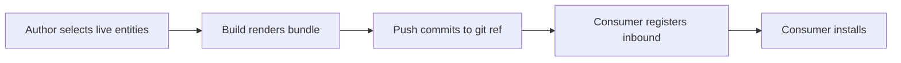

## Concept

A harness is a git repository that ships a bundle of primer entities - agents, graphs, collections, documents, and toolsets - as a single versioned artifact. Installing a harness creates all those entities in one operation. Updating to a new commit is a two-step Fetch and Sync.

Think of a harness as a "Helm chart for primer": a packaged, versioned bundle (like a Helm chart) that a teammate or customer can drop into their own primer instance and run immediately. The upstream repo is the source of truth; the installed entities on disk follow it.

Harnesses solve two problems:

1. **Repeatability.** A tuned configuration - carefully-worded system prompts, a specific graph topology, a curated collection of documents - is easy to share as a URL instead of as a set of screenshots and manual steps.
2. **Manageability.** When the upstream repo updates (an improved prompt, a new graph node, a revised document), a Fetch and Sync pulls it in without touching entities the operator has edited locally.

### Lifecycle states

A harness moves through these states:

| Status | Meaning |
|---|---|
| `draft` | Registered but not yet fetched. No bundle is loaded. |
| `ready` | Fetched but not yet installed. Bundle and overrides schema cached. |
| `installed` | Applied. Managed entities are live. |
| `outdated` | Installed, but the upstream repo has a newer commit. |
| `error` | The last fetch, install, or sync failed. Error details shown on the detail page. |

### Overrides schema

A harness can declare a JSON Schema for overrides - a set of deployment-specific values (API keys, base URLs, tenant identifiers) that the bundle renders at install time. Operators fill in the override values before installing; they are validated against the schema before the INSTALL operation proceeds. If no schema is declared, no override step is needed.

### Managed entities and local edits

Every entity the harness creates is tracked. Entities you edit after install are still listed under Managed objects but are flagged as locally modified. A Sync does not overwrite locally-modified entities - they retain your edits. An Uninstall shows the modified entities and asks whether to keep or remove them.

## Configuration

### Harness fields

| Field | Notes |
|---|---|
| **Name** | Human-readable label. Editable after creation. |
| **Slug** | Kebab-case identifier. Must match `^[a-z][a-z0-9-]{1,63}$`. Unique. Auto-derived from name. Used as the entity id prefix for all managed entities. |
| **Git URL** | HTTPS URL of the repository (for example, `https://github.com/org/repo`). |
| **Ref** | Branch, tag, or commit SHA to track. Defaults to `main`. Changing this after install marks overrides dirty. |
| **Subpath** | Optional subdirectory within the repo that contains `harness.yaml`. Leave blank for the repo root. |
| **Git token** | Optional personal access token for private repos. Stored encrypted. |
| **Description** | Optional. |
| **Overrides** | The deployment-specific values dict. Validated against the harness's overrides schema before install. |

## Walkthrough

```embed:harness
```

### Registering a harness

1. Navigate to **Harnesses** in the left nav.
2. Click **Register from git**.
3. In the **Register harness** dialog, fill in the **Source** step: name, slug, Git URL, ref, subpath (optional, the subdirectory containing `harness.yaml`), git token (optional for private repos).
4. Click **Fetch**. Primer creates the harness record and pulls bundle metadata from the remote. A progress indicator shows while the fetch runs.
5. If the harness declares an overrides schema, an **Overrides** step appears. Fill in the required fields and click **Create**.
6. Once the install operation completes, the status shows **INSTALLED** and the console navigates to the harness detail page.

```callout:warning
If the fetch step returns an error, check that the Git URL is correct and that the branch or tag exists. For private repos, verify the Git token has read access to the repository. The error message is shown inline in the dialog.
```

### Updating to a new commit

When the upstream repo has new commits, the harness status changes to **OUTDATED**.

1. Open the harness detail view.
2. Click **Fetch** to pull the latest commit metadata. The Metadata panel updates the **Available commit** field once the fetch completes.
3. Click **Sync** to re-apply the bundle from the new commit. Status returns to **INSTALLED** when done.

Fetch and Sync are separate so you can inspect the incoming commit before applying it. Both buttons are disabled while any pending operation is in progress.

### Inspecting managed objects

The **Managed objects** panel on the harness detail page lists every entity the harness created, grouped by type: Agents, Graphs, Collections, Documents, Toolsets.

Each group shows the entity ids. Locally-modified entities are flagged. A Sync re-applies the upstream bundle but does not overwrite flagged entities.

### Uninstalling a harness

1. Open the harness detail view.
2. Click **Uninstall** and confirm.
3. The worker cascade-deletes every entity the harness created that has not been locally modified. Locally-modified entities are listed in the confirmation dialog so you can decide whether to keep or remove them.

```callout:warning
Uninstall removes the harness record and all unmodified managed entities. This cannot be undone. Entities you edited after install appear in the confirmation dialog - you decide whether to keep or delete them.
```

## Building an outbound harness

Everything above describes the *inbound* direction: installing a packaged bundle someone else published. The *outbound* direction is the other half - authoring your own harness from the live entities in your instance and pushing it to a git repo so others can install it.

An outbound harness has `direction: outbound`. Instead of pulling entities out of a repo, it tracks a set of your existing agents, graphs, toolsets, and collections, renders them into bundle templates, and commits the result to a remote ref.



### What an outbound bundle packages

A build assembles a self-contained bundle in the configured repo and ref:

| Artifact | Contents |
|---|---|
| `harness.yaml` | Bundle metadata: name, slug, description, and the tracked-entity manifest. |
| `templates/<template_name>.yaml` | One file per tracked entity. The live entity is exported, system-managed fields are stripped, and each override mapping replaces a value with a `{{ overrides.<path> }}` token. A tracked `document` now exports its body as `content_inline`, so the install restores the actual content rather than an empty shell. |
| `overrides.schema.json` | A composed JSON Schema derived from every override mapping. This becomes the consumer's overrides form at install time. |
| `bundle_hash` (build metadata, not a file) | A stable hash computed over the whole rendered set, used to detect drift between the live entities and the last push. |

### Tracked entities and override mappings

Each tracked entity records:

| Field | Notes |
|---|---|
| **kind** | One of `agent`, `graph`, `toolset`, `collection`, `document`. |
| **source_id** | The id of the live entity to export. |
| **template_name** | The bundle filename (without extension). Must be unique within the harness. |
| **overrides** | A list of override mappings. Each maps a field in the exported entity (a JSON pointer, `field_path`) to an `override_path` in the consumer's overrides, optionally with a picker `widget` and a `schema_override` fragment that refines the generated schema slot. |

Templatizing a field turns a hard-coded value (for example, a specific LLM provider id) into a slot the consumer fills in when they install. A mapping with `override_path: llm.provider_id` and `widget: llm-provider-picker` renders an LLM-provider dropdown on the consumer's install form, so a bundle authored against your provider installs cleanly against theirs.

Entities already managed by an *inbound* harness cannot be tracked outbound - they are owned by their upstream bundle and appear greyed out in the picker.

### Building one from the console

1. Navigate to **Harnesses** and click **Build outbound**. The four-step builder opens.
2. **Metadata.** Enter name, slug (checked for uniqueness as you type), description, the destination Git URL and ref, an optional subpath, and a git token with push access (stored encrypted).
3. **Entities.** Pick the agents, graphs, toolsets, and collections to track. Give each a unique `template_name` - this becomes its filename in the bundle.
4. **Templatize.** For each tracked entity the builder renders its JSON tree. Click **Templatize** on any field to make it configurable: set the `override_path` and optionally choose a picker widget. Existing mappings show as badges you can click to remove.
5. **Link & push.** Review the summary and tracked-entity list. Tick **Push now after build** to commit immediately, or leave it unticked to build (compute the bundle and check for drift) without pushing yet. Click **Create**.

```
Build outbound harness - Step 4: Link & push
┌────────────────────────────────────────────────┐
│ Summary                                         │
│   Name        My outbound harness               │
│   Slug        my-outbound-harness               │
│   Direction   outbound                          │
│   Git URL     https://github.com/org/bundle     │
│   Ref         main                              │
│   Tracked     2 entities                        │
├────────────────────────────────────────────────┤
│ Tracked entities                                │
│   agent       agent-main          1 mapping     │
│   toolset     search-tools        0 mappings    │
├────────────────────────────────────────────────┤
│ [x] Push now after build                        │
│                          [ Cancel ]  [ Create ] │
└────────────────────────────────────────────────┘
```

The builder creates the harness with `direction: outbound`, enqueues a **build**, and (if you ticked the box) a **push**. It polls until each operation finishes, surfacing any error inline.

### Re-building, pushing, and drift

From an outbound harness's detail page:

- **Check drift** enqueues a build that re-renders the tracked entities and recomputes the bundle hash. If your live entities have changed since the last push, the harness moves to **OUTDATED** and a drift indicator appears next to the affected tracked entities.
- **Edit tracked entities** re-opens the builder at the Templatize step so you can add or remove tracked entities and mappings.
- **Push** commits the rendered bundle and pushes it to the remote ref. It is enabled when the harness is **DRAFT** or **OUTDATED**. The **Last push** panel records the commit SHA, timestamp, and bundle hash.

### How a consumer installs your outbound harness

The repo your build pushes to is an ordinary inbound bundle. A consumer registers it exactly like any other harness: they point **Register from git** at your Git URL and ref, fetch it, fill in the overrides your mappings declared (rendered from `overrides.schema.json`), and install. The two directions meet at the git repo - you publish to it, they consume from it.


```ref:features/agents
Agents and their configuration fields.
```

```ref:toolsets/toolsets-system
How a harness attaches toolsets to agents using the two-level binding model.
```

```ref:reference/api-harnesses
Full harness resource schema, register, fetch, sync, and uninstall endpoints.
```
