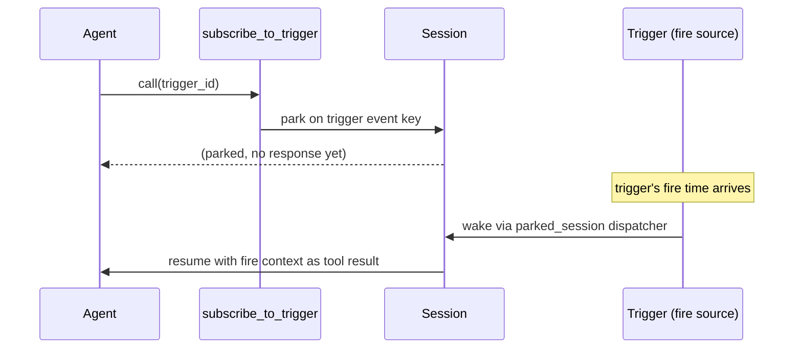
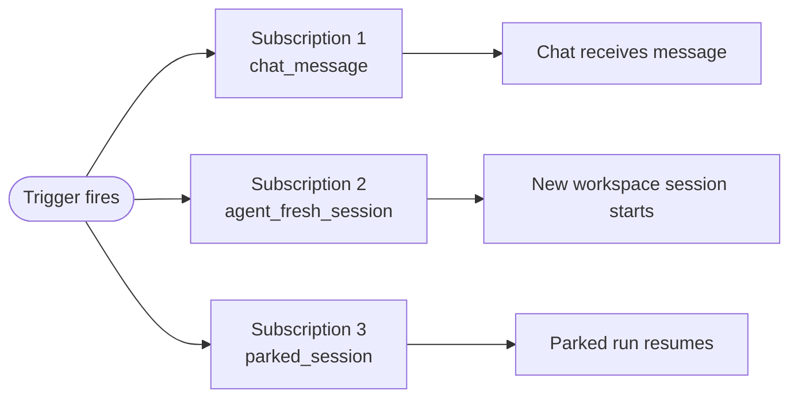

## Concept

A trigger is a fire source. It describes **when** something should happen. A subscription is the delivery rule attached to a trigger - it describes **what** happens when the trigger fires. Keeping them separate lets one trigger fan out to many targets: a single nightly schedule might start a fresh agent session, post a summary to a chat, and wake a run that has been parked waiting for it.

Primer ships three trigger kinds:

- **Delayed** - fires once at a specific UTC instant, then disables itself. Use this for one-off deferred work: "run this analysis tomorrow at 09:00".
- **Scheduled** - fires on a five-field cron expression evaluated in a configurable IANA timezone. The minimum granularity is one minute. Use this for recurring work: nightly reports, hourly syncs, weekly digests.
- **Webhook** - fires when an HTTP POST arrives at a generated URL. The caller does not need to know your schedule. Use this when an external system drives the timing: a CI pipeline, a payment processor, or a monitoring alert.

Four subscription kinds control where each fire lands:

| Kind | What it does |
|---|---|
| `chat_message` | Appends a user message to an existing chat |
| `agent_fresh_session` | Starts a fresh workspace session bound to an agent |
| `graph_fresh_session` | Starts a fresh workspace session bound to a graph |
| `parked_session` | Wakes a session parked on the trigger (written by `subscribe_to_trigger`) |

Each subscription can carry a **payload template** - a Jinja2 string rendered against the fire context at dispatch time. One trigger can feed completely different payload shapes to different subscriptions. The fire context exposes `trigger_id`, `trigger_slug`, `kind`, `fired_at`, `scheduled_for`, `fire_id`. Webhook triggers also expose `webhook_body`, `webhook_headers`, `webhook_query`, and `webhook_method`.

### The park and resume model

The `workspace_ext__subscribe_to_trigger` yielding tool bridges a running agent into the trigger system. It lives in the `workspace_ext` toolset (bound explicitly on the agent, registered only when the agent runs in a workspace session). When an agent calls this tool with a trigger id, the session parks immediately and releases its worker. No compute is consumed while parked. When the trigger fires, the `parked_session` subscription dispatcher wakes the session and delivers the fire context as the tool result. The agent picks up from where it left off.



This pattern lets an agent express "check back when the nightly build finishes" or "wait for the next cron tick and then continue" without holding an open connection or polling. The subscription row is written before the park takes effect, so a fire that races the park still finds the subscription and wakes the session correctly.

A scheduled trigger combined with `subscribe_to_trigger` produces a durable recurring loop: the agent parks after each run, the trigger wakes it on the next cron tick, and the cycle continues with no held connection between ticks.

### Catchup policies for scheduled triggers

When a scheduled trigger is disabled during a window that would have fired, the catchup policy controls what happens when it re-enables:

| Policy | Behaviour on re-enable |
|---|---|
| `one` | Fire once for the entire missed window (default) |
| `all` | Fire once per missed instant, capped at 64 |
| `none` | Drop the missed window entirely |

### Webhook triggers and HMAC

Webhook URLs are unauthenticated by design - any caller with the URL can fire the trigger. The token in the URL is the primary access control (32 random hex characters, server-minted, unguessable). For stronger caller verification, enable HMAC: callers must include `X-Primer-Signature: sha256=<hex>` (HMAC-SHA256 over the raw request body) with every POST or primer rejects the request with 401.

Rate limiting is 60 requests per minute per token (in-process sliding window). Bodies are capped at 1 MB. Webhook dispatch is fire-and-forget: the caller receives 202 immediately; subscriptions run asynchronously.

## Configuration

### Trigger fields

| Field | Notes |
|---|---|
| **Name** | Required. Human-readable label. |
| **Slug** | Auto-derived from name but editable. Must match `^[a-z][a-z0-9-]{1,63}$`. Unique. |
| **Description** | Optional. |
| **Kind** | `delayed`, `scheduled`, or `webhook`. Immutable after creation. |
| **Enabled** | Toggle on the detail page. Disabled triggers do not fire. |

**Delayed-specific fields:**

| Field | Notes |
|---|---|
| **Fire at** | UTC datetime. The console accepts local time and converts. |

**Scheduled-specific fields:**

| Field | Notes |
|---|---|
| **Cron** | Standard five-field expression (`m h dom mon dow`). Validity is checked with `croniter.is_valid` (which also accepts croniter's extended six-field, seconds-first form). |
| **Timezone** | IANA timezone name (e.g. `America/New_York`). Defaults to `UTC`. |
| **Catchup** | `one` (default), `all`, or `none`. See catchup policies above. |

**Webhook-specific fields:**

| Field | Notes |
|---|---|
| **Token** | Server-minted 32-hex-char URL token. Never logged. Rotatable. |
| **HMAC secret** | Optional. When set, callers must sign requests. Clearable. |

### Subscription fields

| Field | Notes |
|---|---|
| **Kind** | `chat_message`, `agent_fresh_session`, or `graph_fresh_session`. (The `parked_session` kind is written only by `subscribe_to_trigger`.) |
| **Target** | Chat, or workspace + agent, or workspace + graph - depends on kind. |
| **Payload template** | Jinja2 template rendered against the fire context. For graph subscriptions the rendered output must be valid JSON matching the graph's Begin `input_schema`. |
| **Parallelism** | `skip` - if the previous fire's unit is still in-flight, this fire is a no-op. `queue` - always dispatch regardless of in-flight state. Ignored for `parked_session` subscriptions. |
| **Enabled** | Toggle per subscription. A disabled subscription is skipped on every fire. |

## Walkthrough

### Creating a trigger

```embed:trigger-create
```

1. Navigate to **Triggers** in the left nav.
2. Click **Create trigger**.
3. **Step 1 - Kind**: choose `Delayed`, `Scheduled`, or `Webhook`.
4. **Step 2 - Config**: fill kind-specific fields.
   - Delayed: pick a date and time. The console converts from browser local time to UTC.
   - Scheduled: enter the cron expression, select a timezone from the dropdown (pre-seeded to your browser's timezone), and choose a catchup policy.
   - Webhook: no additional config. The server mints the token automatically.
5. **Step 3 - Details**: enter a name. The slug auto-populates from the name but can be overridden.
6. Click **Create**. The console navigates to the trigger detail page.

```callout:warning
Trigger kind and the core schedule config (cron expression, timezone, fire_at) are immutable after creation. To change these, delete the trigger and recreate it. Name, description, and enabled flag can be changed at any time from the detail page.
```

### Adding subscriptions

1. Open the trigger detail page.
2. In the **Subscriptions** panel, click **Add subscription**.
3. Choose a subscription kind: `chat_message`, `agent_fresh_session`, or `graph_fresh_session`.
4. Select the target (chat, or workspace plus agent or graph).
5. Optionally enter a payload template. Fire context variables available: `{{ trigger_id }}`, `{{ trigger_slug }}`, `{{ kind }}`, `{{ fired_at }}`, `{{ scheduled_for }}`, `{{ fire_id }}`. Webhook triggers also expose `{{ webhook_body }}`, `{{ webhook_headers }}`, `{{ webhook_query }}`, `{{ webhook_method }}`.
6. Choose parallelism: `skip` or `queue`.
7. Click **Add subscription**.

### Webhook setup

After creating a webhook trigger:

1. On the detail page, click **Copy URL** to copy the full `POST /v1/webhooks/{token}` URL.
2. Give the URL to your external system. It can POST to this URL to fire the trigger.
3. Optionally, click **Set** under HMAC secret to add a shared secret. Your external system must then sign each request body with HMAC-SHA256 and include the digest in `X-Primer-Signature: sha256=<hex>`.
4. If the token is ever compromised, click **Rotate token** to generate a new URL and immediately invalidate the old one.

### Firing manually

Click **Fire now** on the trigger detail page to dispatch all enabled subscriptions immediately, outside the normal schedule. The status panel shows the fire id and subscription count dispatched. Use this to test subscriptions after setting them up.




```ref:workspaces/yielding-tools
How subscribe_to_trigger parks a session and how the resume mechanism works.
```

```ref:workspaces/workspaces-and-sessions
Session lifecycle and parked_status transitions.
```

```ref:features/chats
How a chat_message subscription delivers to a chat.
```

```ref:reference/api-triggers
Full trigger and subscription REST endpoints with request and response schemas.
```
