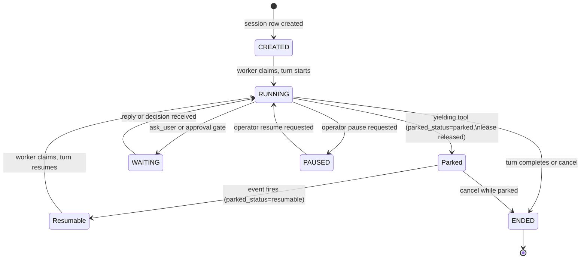

## What workers are

A **worker** is the process (or process thread) that actually executes an agent turn. When a session becomes runnable (either newly started or resumed after a park), a worker claims it from the queue, runs one turn end to end, and releases the lease when done. Multiple workers run in parallel; each handles up to its configured capacity of sessions concurrently.

The **claim engine** (sometimes called the scheduler) is the background loop that continuously polls for runnable sessions and assigns them to free worker slots. The claim engine and the worker pool together form the runtime that keeps work moving.

No configuration is required to use the worker pool: primer starts a worker in the same process as the API by default. The Workers page in the console lets you monitor pool state, inspect in-flight capacity, and drain workers before taking them out of service.

## How the claim and lease model works

Every runnable or resumable session holds a **lease row** in storage. A session becomes claimable when its `turn_status` flips to `claimable`, which upserts the lease. The claim engine then polls for sessions whose lease is free (unclaimed or expired) and whose `parked_status` is absent or `resumable` (a `parked` session is invisible to claimers). A worker wins the claim atomically using a row-level lock (`FOR UPDATE SKIP LOCKED` on Postgres, a serialised write in single-process mode). Only the lease-holder executes the turn.

When a worker holds a lease it heartbeats on a regular interval, refreshing the lease expiry timestamp. If the worker crashes without releasing the lease, the timestamp eventually passes and the lease becomes claimable again. Another worker can then re-claim and continue the run.

Two safety properties hold across the lifecycle:

**No double-claim while running.** Competing workers skip a row that is already locked. Only one worker ever holds a lease at a time.

**Stale workers cannot write.** If a worker loses its lease (because the TTL expired while it was stalled) and then tries to commit results, the platform detects the mismatch and rejects the write. The stale worker discards its output. The run is re-executed by the worker that holds the current lease.

The lease TTL is at least twice the heartbeat interval by design. A single missed heartbeat cannot expire a lease; only a genuine stall or crash causes expiry. The platform refuses to start with a misconfigured TTL.

## Session states and the park sub-state

A session carries two orthogonal axes of state:

- **`status`** (`CREATED` / `RUNNING` / `WAITING` / `PAUSED` / `ENDED`): the operator-visible lifecycle.
- **`parked_status`** (`parked` / `resumable` / absent): the internal park state, only set while `status = RUNNING`.

When a yielding tool fires, the turn raises a `YieldToWorker` signal. The worker catches it, snapshots the in-progress message history and park metadata into a `ParkedState` blob, and releases the lease with `drop_lease=False` (meaning the session stays as the worker's charge but the lease row is cleared from the claim pool). The claim predicate excludes rows where `parked_status IS NOT NULL`, so no other worker will pick up the session while it waits.



When the awaited event fires, the bus listener atomically flips `parked_status` from `parked` to `resumable`, making the session eligible for the next claim sweep. Whichever worker wins the claim rehydrates the `ParkedState` blob and continues the turn from where it parked, injecting the tool result into the LLM message history.

## Reading the Workers page

The Workers page polls every two seconds and shows live pool state.

```embed:workers-stats
```

### Summary strip

Four tiles across the top give a quick snapshot:

| Tile | What it shows |
|---|---|
| Total | Every registered worker, including ones currently draining. |
| Active | Workers ready to accept new claims. The sub-label shows how many are draining. |
| Running now | `in-flight / total-capacity`. Left: leases currently executing. Right: the sum of every active worker's slot count. |
| Scheduler | Whether the claim engine is polling. Shows time since the last claim cycle. |

The **Running now** tile turns amber when utilisation exceeds 80 percent. At 100 percent the pool is saturated and new work queues until a slot frees up.

### Worker table

Each row represents one worker process:

| Column | Description |
|---|---|
| ID | The worker identifier. |
| Host / PID | Hostname and process id. |
| Status | `active` (green), `draining` (amber), or `dead` (red). |
| Capacity | A segmented bar showing in-flight slots vs. total capacity, plus session count. |
| Last heartbeat | Seconds since the worker last checked in. Turns red after 30 seconds. |
| Started | Relative time when the process registered. |

Use the filter bar to search by worker ID or host, or click a status chip (all / active / draining / dead) to narrow the list.

```callout:warning
A worker whose heartbeat exceeds 30 seconds is not necessarily dead; it may be occupied by a long-running tool call. Check the Capacity column: if the session count is zero and the heartbeat is stale, the process has likely crashed. The pool will restart it automatically. If the session count is non-zero, the worker is alive but busy.
```

### Scheduler tile

The Scheduler tile shows whether the claim engine is alive. If it turns red or shows a stale last-claim time, new sessions will queue but not start. Check worker logs for scheduler-related errors.

## Configuration

The worker pool is configured at startup. Key parameters (set in the primer config or environment):

| Setting | Default | Description |
|---|---|---|
| Worker capacity (`concurrency`) | 8 | Maximum concurrent sessions per worker. Increase for I/O-bound workloads, decrease if sessions are CPU-heavy. |
| Lease TTL (`lease_ttl_seconds`) | 30 | How long a held lease stays valid without a heartbeat. Must be at least twice the heartbeat interval. |
| Heartbeat interval (`heartbeat_interval_seconds`) | 10 | How often a running worker refreshes its lease expiry. |
| Poll interval (`poll_interval_seconds`) | 2.0 | How long the claim loop waits between poll cycles when idle. |
| Drain timeout (`drain_timeout_seconds`) | 120 | How long a drain waits for in-flight sessions before forcing the worker down. |

## Walkthrough: draining a worker

Drain a worker before a planned restart or scale-down so in-flight sessions complete cleanly without being re-claimed mid-turn.

1. Open **Workers** in the console.
2. Find the worker row you want to drain.
3. Click **Drain** on the right side of the row. A confirmation modal shows the number of in-flight sessions that will finish before the drain completes.
4. Click **Drain worker** to confirm. The worker status changes to `draining`.
5. Poll the worker table (it refreshes every two seconds) until the session count in the Capacity column reaches zero.
6. The worker exits cleanly. The scheduler stops seeing it and the row transitions to `dead`.

A draining worker accepts no new claims. Once all in-flight sessions complete the worker exits. Calling Drain on an already-draining worker is a no-op.


```ref:workspaces/yielding-tools
How yielding tools park a session, release the lease, and queue the session for resume.
```

```ref:workspaces/workspaces-and-sessions
The full session lifecycle, including WAITING, PAUSED, and ENDED states.
```

```ref:reference/api-workers-health
The worker list, drain endpoint, and liveness health check.
```
