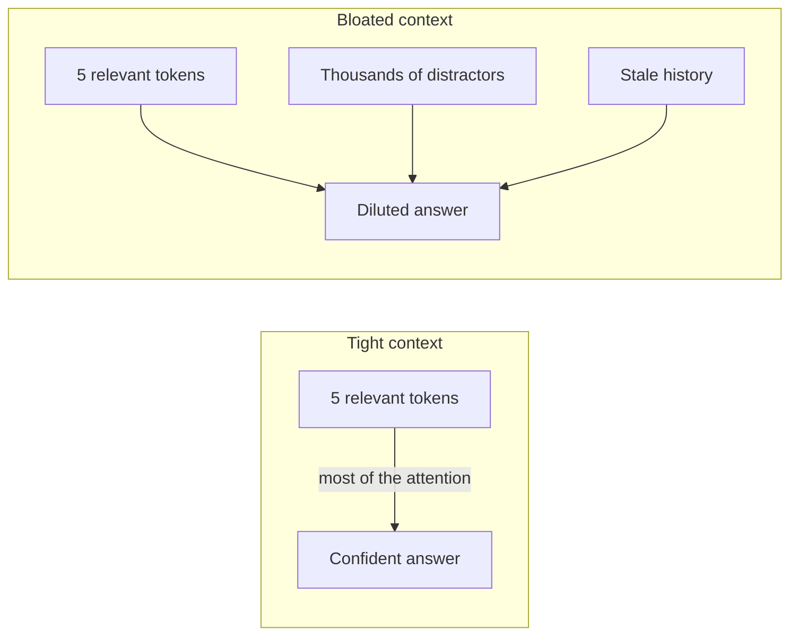
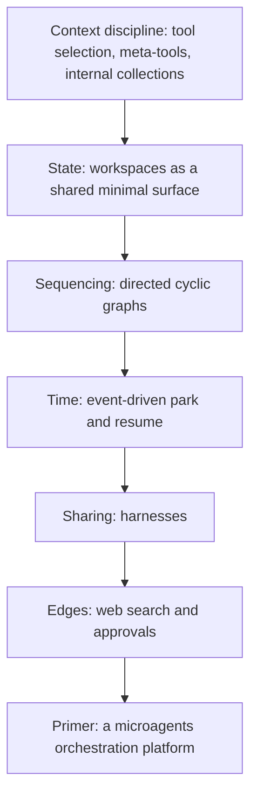

## What primer is

Primer is an unopinionated, batteries included agent orchestration platform with a strong focus on context optimization.

Let's break that down. "Unopinionated" means primer does not force you into one fixed workflow - you compose the pieces yourself. "Batteries included" means LLM providers, workspaces, graphs, channels, and vector search all ship with primer and work together out of the box. "Context-first" means every feature exists to keep each agent's working context small and clean, because that is what makes agents accurate and predictable.

## Why context, not scale

A language model does not read your prompt the way you read a page. It spreads a fixed budget of attention across every token in the context all at once. When your context is tight, the handful of tokens that actually matter get most of that attention. When your context is bloated with stale history, unused tool definitions, and irrelevant background, those same important tokens now compete with thousands of distractors. Each distractor pulls a little attention away, and the signal on the tokens that matter gets thinner. This is sometimes called the "lost in the middle" effect: models retrieve facts well when those facts appear near the start or end of a long input, and noticeably worse when the same facts are buried in the middle.

Primer's core bet is that a small model given a clean, purpose-built context can rival a much larger model on the narrow task that context is built for. That is a hypothesis primer is built to test, not a settled result. The bet is that you often do not need the biggest model, if you give the model you have exactly what it needs and nothing more. The thesis implies that a tightly scoped context is not just a crutch for modest hardware but a lever on any model, large or small.

That same logic applies to frontier models. More parameters let a large model tolerate noisy contexts better, but the attention-dilution problem is structural, not a quirk of small models. A frontier model running on a bloated context is still fighting the same headwind, just with more horsepower. Cleaning up the context makes it better too.



## What you can build

Here are the seven things primer is built to let you do:

**Run multiple agent configurations in parallel on the same context** - You can point several different agent configurations at the same conversation and switch between them while the conversation history carries forward. Start a chat with one agent, then swap the same chat to a different agent and continue right where you left off. The conversation context is shared; you are just changing which agent configuration is driving it.

**Build reusable workflows and graphs** - Wire agents into directed graphs that can loop. The most useful pattern is a producer-and-judge feedback loop, where one agent drafts a piece of work and another critiques it, and the loop runs until the judge is satisfied. Graphs let you express multi-step reasoning as structure instead of squeezing it into a single prompt.

**Create knowledgebases through vector databases** - Store documents in collections with embedding-backed semantic search. When an agent needs information, it retrieves only the few most relevant chunks, not the entire document. This keeps injected context tight and keeps retrieval fast.

**Dogfood the platform by building agents that build other agents** - "Dogfooding" here means using primer to build primer: the platform's own agent APIs are what you use to create more agents. An agent can create and run other agents programmatically, so you can grow your fleet from inside primer itself. Build a scaffolding agent that sets up new specialists on demand, or write a meta-agent that composes a custom pipeline for each incoming request.

**Build dynamic agents that search and invoke other agents and tools** - With two meta-tools (search and call), an agent can discover and use any tool or agent in the system without carrying the whole catalog in its context. The agent asks "is there a tool for this?" at runtime, gets a small answer, and calls it. The catalog never bloats the prompt.

**Export harness templates on git repos** - Export a tuned set of agents, graphs, and collections to a git-backed bundle, then share it so others can install it in one step. Think of it as "Helm for primer": your configuration becomes a versioned artifact that a teammate or customer can drop into their own instance and run immediately.

**Connect agents to channels like Slack and Telegram** - Bridge agents to Slack, Telegram, and Discord so they can ask people questions, request approvals, and be triggered directly from a channel message. Long-running work can park and wait for a human response, then resume when the reply comes in.

## How it fits together

Think of primer as a stack of layers, where each layer keeps the one below it from getting cluttered.

Context discipline (tool selection, meta-tools, collections) keeps each agent's prompt lean. Workspaces provide shared state so agents can hand off results without carrying history in their own context. Directed cyclic graphs handle sequencing. Event-driven park-and-resume handles time, freeing compute while work waits on a slow tool or a human. Harnesses handle sharing, packaging a working configuration into a versioned bundle. Web search and approval gates handle the edges where agents reach outside the platform.



## Loop engineering

A growing practice called loop engineering reframes how people work with coding agents. Instead of prompting an agent one turn at a time, you design a *system* that prompts it: a loop that wakes on a schedule, works toward a stated goal, checks its own output, and escalates to a human only when it should. The leverage moves from writing a good prompt to designing a good loop. As the practice puts it, you stop being the person who prompts the agent and start being the person who designs the system that prompts it.

That practice names a specific set of building blocks every loop needs. Primer exists to provide them, integrated and runnable on your own hardware.

- **A heartbeat** - something that surfaces work on a cadence instead of waiting for you to type. Primer's **triggers** start a fresh agent or graph session, or resume a parked one, on a cron schedule, after a delay, or on a webhook.
- **Isolation** - parallel agents that do not step on each other. Primer's **workspaces** give each agent its own sandbox (local, container, or Kubernetes) with a persistent, git-backed filesystem.
- **Durable memory** - the model forgets between runs; the repository does not. Primer keeps state in **git-backed workspaces** and in **knowledge collections** that agents retrieve from, so knowledge compounds across iterations instead of resetting each time.
- **A maker and a checker** - the agent that wrote the work is a poor judge of it. Primer's **directed cyclic graphs** make the producer-judge loop a first-class structure: one agent drafts, another critiques it against a schema or a rubric, and the loop repeats until the check passes.
- **Connectors** - a loop has to touch real tools and real people. Primer is an **MCP server** (and an MCP client), and it bridges agents to **Slack, Telegram, and Discord**.
- **A human gate** - approve the risky, let the safe run. Primer gates sensitive tool calls behind **human approvals** and lets work **park and resume**, so an agent can wait on a person for hours without holding compute.

Primer does not press "go" on the loop for you, and it is built so that you do not have to surrender your judgment to run one. Each iteration gets a clean, purpose-built context rather than an ever-growing transcript, which is the same context discipline that keeps a single agent accurate, now applied over and over. That is what lets a loop run for a long time without drifting. To borrow the practice's own advice: build the loop like someone who intends to stay the engineer, not just the person who presses go.

## Next

Ready to see it in action? The quickstart walks you through building a real agent end to end.

```ref:getting-started/quickstart
A hands-on walkthrough: build a blog content assistant end to end.
```
