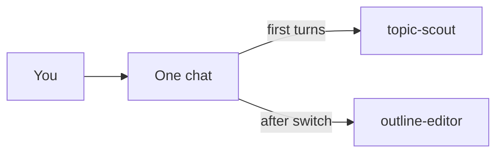
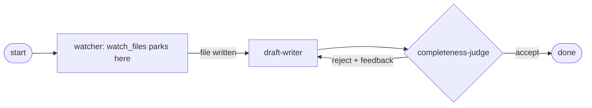

In this guide you will build a small "blog content assistant" from scratch using primer. Everything runs from the console against a free LLM key, and each step builds directly on the last. By the end you will have two agents, a shared chat, a semantic router, a workspace file, and a graph that watches for that file and then drafts and reviews a blog post.

## Step 0 - Install and start

Install primer and start the API server, then open the console at http://localhost:8000/console/. This tutorial uses semantic search and internal collections, so install the batteries-included `[full]` build.

```code-tabs:bash
--- bash
# pipx (needs Python 3.12+)
pipx install 'primer-ai[full]'
primer api

# or Docker (no Python toolchain)
docker run --rm -p 8000:8000 ghcr.io/primerhq/primer:0.2.0
```

```callout:info
The bare `pipx install primer-ai` installs a lean core (REST API, console, MCP, storage, API-based providers). The `[full]` extra adds local embeddings, document ingestion, channels, and container / Kubernetes backends - including the semantic search this tutorial uses.
```

## Step 1 - Add an LLM provider (OpenRouter)

Get a free API key at [openrouter.ai](https://openrouter.ai/). In the console, go to Providers, then LLM, then Add provider. Choose provider type "openrouter" and paste your key; the base URL is already filled in, so you only need the key.

Once saved, enable a free model such as `meta-llama/llama-3.1-8b-instruct:free` from the models list, and set its context length to match the model. `llama-3.1-8b-instruct` has a 128K-token context window, so `131072` is the right value (if you leave it too low, longer chats and the graph in Step 6 will truncate their history).

```embed:llm-provider-openrouter
```

```ref:reference/api-providers
Provider types, config fields, and model discovery.
```

## Step 2 - Create two agents

You will create two lightweight agents for this guide:

- **topic-scout**: given a broad theme, brainstorms five blog topics. No tools needed.
- **outline-editor**: takes one chosen topic and turns it into a structured outline with sections and bullet points.

For each agent, open Agents, click New agent, fill the Basic tab (name, description, and the model: select the OpenRouter provider you created in Step 1, then pick the `meta-llama/llama-3.1-8b-instruct:free` model), then open the Advanced tab to paste the system prompt below, and save.

**topic-scout** system prompt:

```code-tabs:text
--- text
You are topic-scout, a blog ideation assistant. Given a broad theme from
the user, propose exactly five specific, distinct blog post topics aimed at
a general technical audience.

For each topic, give a short working title followed by a one-sentence angle
that says what the post would cover and why a reader would care. Prefer
concrete, specific angles over generic ones, and avoid overlap between the
five. Number them 1 to 5.

Do not write the posts themselves, and do not ask clarifying questions: if
the theme is broad, make reasonable assumptions and proceed. Keep the whole
reply under 200 words.
```

**outline-editor** system prompt:

```code-tabs:text
--- text
You are outline-editor. The user gives you a single blog post topic, often
chosen from a numbered list earlier in the conversation. Produce one clear,
structured outline for that topic.

Format the outline as: a working title, a one-sentence thesis, then 4 to 6
top-level sections as markdown headings. Under each section add 2 to 4
bullet points naming the key idea, a supporting point, or an example to
include. Finish with a short "Call to action" section.

Outline only; do not write full prose paragraphs. If the user refers to
"topic 3" or similar, use the matching topic from the earlier conversation.
```

```embed:quickstart-agents
```

```ref:features/agents
Every field in the agent create modal.
```

## Step 3 - Chat, and switch agents mid-conversation

Open Chats and start a new chat with **topic-scout**. Ask it for five blog topics on a theme you like, for example "getting started with home automation". Once you see the suggestions, switch the same chat to **outline-editor**: the agent switcher is the agent dropdown in the chat composer, at the left of the message box just before the attachment (paperclip) button. Pick **outline-editor** from it, then continue the conversation by asking it to outline topic 3.

The key idea: both agents share the same conversation history. outline-editor can see the topics topic-scout produced, and you did not have to copy anything between windows.

```embed:chat-agent-switch
```



```ref:features/chats
Turn mechanics, the agent switcher, and streaming.
```

## Step 4 - Enable internal collections and a search-and-invoke agent

**Part A: enable the collections.** Go to Internal Collections and click Configure. Choose the bundled local embedder and the pre-configured `lance` semantic search provider; it is local and file-based, so it needs no API key. After saving, the subsystem is in the configured state; click Bootstrap now to index primer's own agents, graphs, tools, and knowledge collections. The subsystem becomes active once bootstrapping completes.

```embed:internal-collections-enable
```

**Part B: create a router agent.** Create a new agent called **content-router** (again selecting the OpenRouter provider and the llama model). Give it the tools `search__search_agents` and `system__invoke_agent`, and the system prompt below:

```code-tabs:text
--- text
You are content-router. Route each user request to the most suitable
existing agent and run it, rather than answering directly.

For every request:
1. Call search__search_agents with a concise query describing what the user
   wants done, to find candidate agents in the internal agents collection.
2. Choose the single best-matching agent from the returned descriptions. If
   nothing matches well, tell the user no suitable agent was found and stop.
3. Call system__invoke_agent with that agent's id and a clear task derived
   from the user's request, passing along any specifics it needs (for
   example, the chosen topic).
4. Return the invoked agent's result to the user, and briefly note which
   agent you picked and why.

Always delegate through the tools; never perform the task yourself.
```

Now open a new chat with content-router and ask: "Find an agent that can outline a blog post and run it on a topic you pick." The agent searches the internal collection, finds outline-editor by description, and calls it, all without you naming it explicitly.

```callout:tip
This is the dogfooding pattern: an agent that finds and runs other agents, with the full catalog kept out of its context behind semantic search.
```

```ref:embedding/internal-collections
The internal collections and the search toolset.
```

## Step 5 - Create a workspace and write a file

Go to **Workspaces** and create a new workspace using the default local provider. Give it a name like "blog-assistant", then open it to enter its **Studio**.

```embed:workspaces
```

Next, create a small **brief-writer** agent (no special tools needed on the agent itself). When an agent runs inside a workspace session, the `workspaces__*` tools, including `workspaces__write_workspace_file`, are registered with it automatically, so you do not add them in the agent's tool list. Just give brief-writer a system prompt telling it to write the content it is given into the requested file.

Back in the workspace's Studio, click the **`+`** on the left sidebar's **Sessions** header and bind the new session to **brief-writer**. Because this is a fresh session with a different agent, it does not share the Step 3 chat history, so paste the outline text produced in Step 3 directly into the session's instructions, and tell the agent to write it into a file called `outline.md`. Start the session; it opens as a center tab and streams its turns as the agent calls `workspaces__write_workspace_file`.

```embed:session-detail
```

When the agent writes `outline.md`, it appears in the **Files** tree in the left sidebar, where you can open, download, or delete it. Step 6's graph watches this same file.

```ref:workspaces/workspaces-and-sessions
Start and monitor sessions inside the workspace Studio.
```

```ref:workspaces/workspace-providers
Workspace providers, templates, and the file tools.
```

## Step 6 - Build and run a graph (watch, draft, judge)

Now tie everything together with a graph. First, create three small agents for the graph nodes: **outline-watcher**, **draft-writer**, and **completeness-judge** (or reuse existing ones if you already have them). A graph runs inside a workspace session, so the in-workspace runtime tools (`ls`, `read`, `write`, `edit`, `glob`, `grep`, `exec`) are auto-registered with its agent nodes. The watcher is the one exception: `watch_files` is a yielding tool in the separate `workspace_ext` toolset, which is **not** auto-registered, so the watcher agent must bind `workspace_ext` explicitly on its Tools tab. Because the graph runs in a workspace session, the bound `workspace_ext` tools are then registered with that agent (they would be suppressed if the same agent ran on a chat). Otherwise you only need to ask for the behavior in the system prompt.

Create a new graph with these nodes:

- **start**: the entry point.
- **watcher**: an agent node (with the `workspace_ext` toolset bound) whose system prompt tells it to call `workspace_ext__watch_files` and wait until `outline.md` appears in the workspace. `workspace_ext__watch_files` is a yielding tool, so the run parks here (see the note below) instead of holding the turn open.
- **draft-writer**: an agent node that reads the outline and writes a full blog draft.
- **completeness-judge**: an agent node with a `response_format` that returns `accept` or `reject` plus brief feedback.
- **done**: the end node that renders the finished draft.

Wire the edges: start to watcher, watcher to draft-writer, draft-writer to judge. Add a conditional router on the judge: `reject` loops back to draft-writer (set `max_iterations` to cap the loop), and `accept` continues to done.

**How the park-resume works.** When the watcher node calls `workspace_ext__watch_files`, the graph suspends (parks) instead of holding an open connection. The run stays parked until the file-change event fires. Writing `outline.md` in your workspace (Step 5 does exactly this) wakes the graph, and the producer-judge loop then runs to completion on its own.

```embed:quickstart-graph
```



```ref:graphs/overview
What a graph is, the node kinds, and when to reach for one.
```

```ref:workspaces/yielding-tools
Why a tool call can suspend a run and how it resumes.
```

```callout:warning
The Step 6 graph parks on a real file watch to show how a run suspends and resumes. If you would rather not wait, write outline.md first, then run the graph.
```

## Where to next

You have seen all the major building blocks: an LLM provider, two agents, a shared chat with an agent switch, a semantic router backed by internal collections, a workspace session that writes a file, and a graph with a park-resume loop. The guides below go deeper on each piece.

```ref:features/agents
How an agent turn actually runs and every configuration field.
```

```ref:features/harnesses
Package your tuned agents and graphs into a shareable, git-backed bundle.
```
