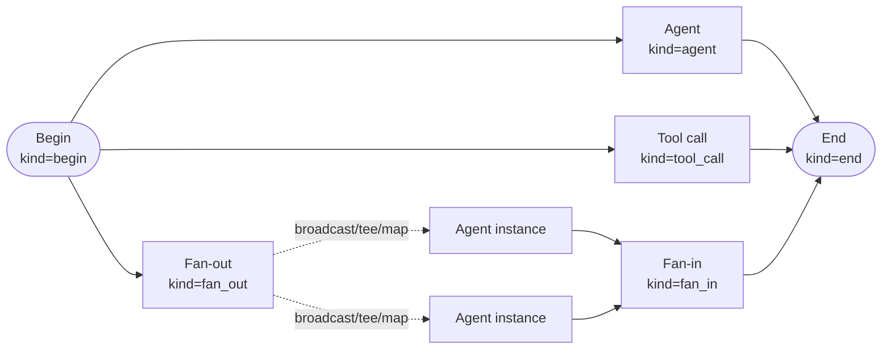
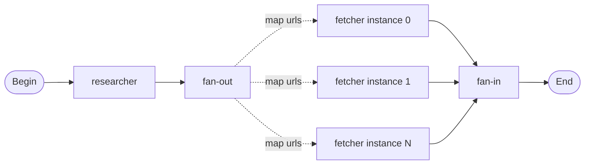

## What node types are

A graph is a set of nodes connected by edges. Each node has a `kind` that tells the executor what to do when the node enters the ready set. Seven kinds exist. Three are pure data-shaping (Begin, End, Fan-in): no LLM call, no tool dispatch. Three run real work (Agent, Subgraph, Tool-call). One is a pure dispatcher (Fan-out).



The discriminated union field is `kind`. The console uses it to show the right side panel. The API uses it to validate the node definition.

## Configuration

### Begin (`kind=begin`)

The Begin node is the graph's entry point. Every graph has exactly one Begin node. It carries no LLM call; it materialises a `NodeOutput` from the graph's initial input and makes it available to downstream templates as `nodes.<begin_id>`.

| Field | Required | Description |
|---|---|---|
| `id` | yes | Unique node id within the graph. |
| `description` | no | Human-readable label shown in the canvas. |
| `input_schema` | no | JSON Schema 2020-12. When set, the session-create handler validates `graph_input` against this schema before the worker dispatches the graph. A mismatch returns 422 immediately, before the session reaches RUNNING. |

When `input_schema` is omitted the graph accepts any JSON-serialisable input shape (string, dict, list).

### End (`kind=end`)

The End node is a sink. At least one End reachable from Begin is required. A graph may have multiple independent End nodes; all fire independently when reached, the ready set drains naturally, and there is no first-End-wins race.

| Field | Required | Description |
|---|---|---|
| `id` | yes | Unique node id. |
| `description` | no | Canvas label. |
| `output_template` | no | Jinja2 template rendered over `GraphContext` when the node fires. The rendered string becomes the graph's final output. An empty string terminates the graph without an output payload. |
| `output_schema` | no | JSON Schema 2020-12. When set, the rendered `output_template` must parse as JSON conforming to this schema. Failure ends the graph with `ended_detail='end_output_invalid'`. |

End nodes have no outgoing edges. Adding one is a hard topology violation.

### Agent (`kind=agent`)

The Agent node runs a full agent turn (a multi-round LLM loop with tool dispatch), exactly as a standalone agent session would, using the same `run_agent_turn` code path. The node keeps its own per-turn message history; the history carries forward across loop iterations.

| Field | Required | Description |
|---|---|---|
| `id` | yes | Unique node id. |
| `agent_id` | yes | Id of the stored agent to execute. |
| `input_template` | no | Jinja2 template rendered over `GraphContext` to produce the user-role message prepended to this node's history before the turn starts. Default: concatenates the graph's initial input verbatim. |
| `response_format` | no | JSON Schema forwarded to the agent's invoke call. When set, the agent is asked for structured output and `NodeOutput.parsed` is populated (a dict). When `None`, the node produces only raw text. Required for conditional edges that branch on this node's output. |
| `description` | no | Canvas label. |
| `input_schema` | no | Designer metadata only: a soft-validation hint the executor logs as a WARNING if the rendered `input_template` does not match. Never fails the node. |

An agent node inside a loop reruns each time the loop brings it back into the ready set, accumulating history across iterations.

### Subgraph (`kind=graph`)

The Subgraph node delegates an entire child graph execution. The child graph runs to completion before the parent's superstep considers the node done. Sub-events are re-wrapped with the parent node's id so event taps can see "subgraph X is running".

| Field | Required | Description |
|---|---|---|
| `id` | yes | Unique node id. |
| `graph_id` | yes | Id of the stored graph to delegate to. |
| `input_template` | no | Jinja2 template rendered to produce the child graph's `initial_input`. Default: concatenates the parent graph's initial input. |
| `description` | no | Canvas label. |

The child graph runs in the same workspace as the parent. Turn logs from the child appear under `<parent_gsid>__<parent_node_id>` so the full nested timeline is queryable.

### Fan-out (`kind=fan_out`)

The Fan-out node is a pure dispatcher. It spawns parallel downstream node instances and stashes an instance plan on the executor. The outer superstep loop drains this plan into the next ready set so all instances run concurrently.

Fan-out nodes must have no real outgoing edges; their downstream targets live entirely on the node's `specs` list.

| Field | Required | Description |
|---|---|---|
| `id` | yes | Unique node id. |
| `description` | no | Canvas label. |
| `specs` | yes (min 1) | List of `FanOutSpec` entries. Multiple specs can be mixed on one Fan-out (broadcast + tee + map). |

#### FanOutSpec

Each spec in the `specs` list selects a dispatch strategy and an `on_failure` policy.

**`kind="broadcast"`**: runs one fixed target node N times in parallel.

| Field | Required | Description |
|---|---|---|
| `target_node_id` | yes | The node to run N copies of. |
| `count` | yes (>= 1) | How many parallel instances to spawn. |
| `on_failure` | no | `fail_fast` (default), `drain_then_fail`, or `collect`. |

**`kind="tee"`**: runs each named target node once in parallel.

| Field | Required | Description |
|---|---|---|
| `target_node_ids` | yes | List of node ids to run in parallel. Each runs exactly once. |
| `on_failure` | no | `fail_fast` (default), `drain_then_fail`, or `collect`. |

**`kind="map"`**: reads a list from an upstream node and spawns one instance per list item.

| Field | Required | Description |
|---|---|---|
| `target_node_id` | yes | The node to run once per item. |
| `source_node_id` | yes | The upstream node whose output holds the list to iterate. |
| `source_path` | yes | Dotted path (e.g. `items` or `results[0].urls`) into `NodeOutput.parsed` of the source node. Must resolve to a list at runtime; failure ends the graph with `ended_detail='fanout_source_invalid'`. |
| `on_failure` | no | `fail_fast` (default), `drain_then_fail`, or `collect`. |

#### `on_failure` policy

This trichotomy controls what happens when one parallel instance fails:

- `fail_fast` (default): the first failure immediately terminates the graph.
- `drain_then_fail`: suppresses the immediate failure, waits for every sibling instance to finish (success or fail), then terminates the graph with `ended_detail='fanin_upstream_failed'`.
- `collect`: stamps the failed instance's `NodeOutput.error`, appends it to the aggregator list so a downstream Fan-in can see and branch on it, and lets the graph continue.

#### Synthesized instance ids

Instances are assigned synthesized ids of the form `target[0]`, `target[1]`, etc. These appear in `GraphContext.nodes` alongside the bare aggregator list at `nodes.<target_id>`. Templates can reference both (see `ref:graphs/graph-templating`).

### Fan-in (`kind=fan_in`)

The Fan-in node waits for all incoming parallel branches to finish before firing. It is a pure data-shaping aggregator with no LLM call.

| Field | Required | Description |
|---|---|---|
| `id` | yes | Unique node id. |
| `description` | no | Canvas label. |
| `aggregate_template` | no | Jinja2 template rendered over `GraphContext` when the node fires. Has access to `nodes.<target>` (the aggregator list) and `nodes['target[i]']` (individual instances). |
| `output_schema` | no | JSON Schema 2020-12. When set, the rendered `aggregate_template` must parse as JSON conforming to it. Failure ends the graph with `ended_detail='end_output_invalid'`. |

Fan-in's ready-set logic is wait-for-all: it fires only when every incoming edge's source has produced a `NodeOutput`. For fan-out targets, "all sources produced output" expands to "all synthesized instances produced output".

### Tool call (`kind=tool_call`)

The Tool-call node invokes a platform tool directly, without spinning up an agent turn. It honours approval gates: if the tool requires operator approval, the graph parks the session WAITING, checkpoints its full mid-flight state, and resumes from the checkpoint when the operator approves or rejects.

| Field | Required | Description |
|---|---|---|
| `id` | yes | Unique node id. |
| `tool_id` | yes | Scoped tool id in `toolset_id__bare_name` form. Syntax is checked at save time; existence is checked when the tool manager dispatches at runtime. |
| `arguments` | no | Argument dict. String leaf values are rendered as Jinja2 templates against `GraphContext` at runtime. Non-string leaves pass through unchanged. |
| `arguments_template` | no | Full-JSON Jinja2 template that shadows `arguments` entirely. Use this when you need to produce a dynamic argument structure (a variable-length list, for example) that cannot be expressed as fixed keys with templated string values. |
| `output_schema` | no | JSON Schema 2020-12. When set, the tool's result output must parse as JSON conforming to this schema. Failure ends the graph with `ended_detail='tool_output_invalid'`. |
| `description` | no | Canvas label. |

When the operator rejects a tool-call approval, the graph ends with `ended_detail='tool_execution_failed'`.

## Walkthrough: fan-out map to fan-in

This pattern takes a list of URLs produced by a research agent, fetches each in parallel, and aggregates.

1. Create a Begin node and a `researcher` agent node wired Begin -> researcher. Give the researcher agent a `response_format` with `{ "type": "object", "properties": { "urls": { "type": "array" } } }`.
2. Add a Fan-out node (`kind=fan_out`) named `fanout`. Wire researcher -> fanout with a Static edge.
3. Add an agent node named `fetcher`. Do NOT add a real edge from `fanout` to `fetcher`; configure it on the Fan-out node's spec instead.
4. In the Fan-out side panel, add one spec:
   - kind: `map`
   - target_node_id: `fetcher`
   - source_node_id: `researcher`
   - source_path: `urls`
   - on_failure: `collect`
5. Add a Fan-in node (`fanin`). Wire `fetcher` -> `fanin` with a Static edge. In the Fan-in's side panel set the `aggregate_template` (see `ref:graphs/graph-templating` for syntax).
6. Add an End node and wire `fanin` -> `end`.
7. Save. This graph needs no `max_iterations` because it has no cycle.




```ref:graphs/graphs
How to create and run a graph from the console.
```

```ref:graphs/graph-templating
How to write Jinja2 templates that access upstream node outputs.
```
