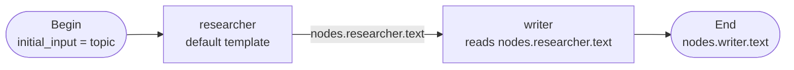

## What graph templating is

Every node in a graph can carry a Jinja2 template that the executor renders just before the node runs. Rendering produces a string: the user-role message that seeds an agent turn, the final output of an End node, or the aggregated text from a Fan-in node.

Templates read from a shared `GraphContext` that the executor builds and extends as nodes complete. The context holds the graph's initial input, all completed node outputs, and the current iteration counter. Templates can reference any completed upstream node by its id.

The template engine uses a `SandboxedEnvironment` with `StrictUndefined`. Sandboxing blocks access to Python internals (`__import__`, dunder attributes). `StrictUndefined` raises an error on undefined variables instead of silently emitting an empty string, so a typo in a template surfaces at run time rather than producing a silently incorrect output.

## Configuration

### The GraphContext variables

Every template has these variables in scope:

| Variable | Type | Description |
|---|---|---|
| `initial_input` | `list[Message]` or `Any` | The graph's initial input as passed at session-create time. When passed as a list of messages, each `m.parts[0].text` is a string. When passed as a raw dict or string, the value is available directly. |
| `iteration` | `int` | The current superstep iteration counter, starting at 0 for Begin. |
| `nodes` | `dict[str, NodeOutput]` | Completed node outputs keyed by node id. |

`NodeOutput` has two attributes you will access most often:

- `nodes.<id>.text`: the node's raw string output (an agent's last assistant turn, or a rendered template).
- `nodes.<id>.parsed`: the `json.loads` of `text` when the node had `response_format` or `output_schema` set; `None` otherwise.

### Where templates appear

| Node kind | Template field | Rendered into |
|---|---|---|
| Agent (`kind=agent`) | `input_template` | User-role message prepended to the node's history before the LLM turn. |
| Subgraph (`kind=graph`) | `input_template` | The child graph's `initial_input`. |
| End (`kind=end`) | `output_template` | The graph's final output string. |
| Fan-in (`kind=fan_in`) | `aggregate_template` | The Fan-in's `NodeOutput.text`, collected from all parallel branches. |
| Tool-call (`kind=tool_call`) | `arguments_template` | Full JSON argument object (shadows the `arguments` dict when set). |
| Tool-call (`kind=tool_call`) | `arguments` values | String-valued leaves in the `arguments` dict are each rendered as a mini-template against `GraphContext`. |

### Default input template

When `input_template` is left blank, Agent and Subgraph nodes use this default:

```
{{ m.parts[0].text }}

```

This iterates over the initial input messages and concatenates their text parts. Override it when you want to pass a specific upstream node's output instead.

### Referencing upstream node outputs

Access any completed upstream node's output by its id:

```
Summarise the following research:

{{ nodes.researcher.text }}
```

When the upstream node had `response_format` set, its parsed output is a dict available at `nodes.<id>.parsed`:

```
The judge said: {{ nodes.judge.parsed.decision }}
Feedback: {{ nodes.judge.parsed.feedback }}
```

Dotted attribute access works because `NodeOutput` exposes `text`, `parsed`, `history`, and `iteration` as attributes directly.

### Referencing the graph's initial input

Pass the raw initial input to an agent:

```
{{ initial_input }}
```

When `initial_input` is a list of messages, iterate over them:

```
{{ m.parts[0].text }}

```

When `initial_input` is a plain string or dict (from `session.metadata['graph_input']`), access it directly:

```
Topic: {{ initial_input.topic }}
Keywords: {{ initial_input.keywords | join(', ') }}
```

### Using the iteration counter

Reference `iteration` to adapt a node's behavior on repeat runs in a loop:

```

Write a first draft on the topic below.

Revise the previous draft based on the judge's feedback:
{{ nodes.judge.parsed.feedback }}


Topic: {{ nodes.begin.text }}
```

### Fan-out templates

When a Fan-out node dispatches instances, the executor injects two extra variables into each instance's template scope:

| Variable | Type | Description |
|---|---|---|
| `fanout_index` | `int` or `None` | Zero-based index of this instance (broadcast and map modes). `None` for tee instances. |
| `fanout_item` | `Any` or `None` | The list item at `fanout_index` for map mode. `None` for broadcast and tee instances. |

A `map` fan-out over a list of URLs, with each fetcher instance receiving its own URL:

```
Fetch and summarise the content at this URL:

{{ fanout_item }}
```

A `broadcast` fan-out where each instance knows its position:

```
You are analyst number {{ fanout_index + 1 }}.
Analyse the following document from angle {{ fanout_index + 1 }}:

{{ nodes.begin.text }}
```

### Fan-in aggregate templates

The Fan-in's `aggregate_template` has access to the full aggregator list at `nodes.<target_node_id>` and each individual instance at `nodes['target[i]']`.

Aggregate a list of results into a single summary:

```


### Source {{ loop.index }}
{{ result.text }}



```

Under `on_failure='collect'`, failed instances have `result.error` set to a non-None string. A collect-mode template can branch on that:

```


- [FAILED] {{ result.error }}

- {{ result.text }}


```

### End node output templates

The End node's `output_template` renders the graph's final output. It has full access to all completed node outputs:

```
# Blog Post

{{ nodes.draft-writer.text }}

---
Reviewed by: {{ nodes.judge.parsed.reviewer }}
Score: {{ nodes.judge.parsed.score }}
```

When `output_schema` is set, the rendered string must parse as valid JSON conforming to the schema. Use Jinja2 to construct the JSON:

```
{
  "title": "{{ nodes.title-agent.text | tojson | trim('"') }}",
  "body": {{ nodes.draft-writer.text | tojson }},
  "accepted": true
}
```

### Tool-call argument templates

The Tool-call node accepts two forms. The `arguments` dict is the ergonomic default; string leaves are each rendered as a mini-template:

```json
{
  "path": "{{ nodes.begin.parsed.filename }}",
  "content": "{{ nodes.draft-writer.text }}"
}
```

When you need to produce a dynamic argument structure (a variable-length list, a conditionally present key), use `arguments_template` instead. This shadows `arguments` entirely and must render to a valid JSON string:

```
{
  "urls": [
    
    "{{ item }}",
    
  ]
}
```

## Walkthrough: chaining two nodes

This walkthrough shows the minimal template chain: a `researcher` agent feeds its output to a `writer` agent.

1. Create a graph with Begin -> `researcher` -> `writer` -> End.
2. Leave `researcher`'s `input_template` at the default. The researcher receives the graph's initial input.
3. Set `writer`'s `input_template` to:
   ```
   Write a blog post based on this research:

   {{ nodes.researcher.text }}
   ```
4. Set the End node's `output_template` to `{{ nodes.writer.text }}`.
5. Save and run with `graph_input` set to your research topic.

The researcher receives the topic, produces research text, and the writer node receives that text as its input.




```ref:graphs/graphs
Creating and running graphs from the console.
```

```ref:graphs/graph-node-types
All node kinds and their template fields.
```
