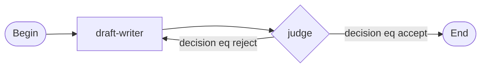

The Graph Designer is the visual canvas for building and editing graphs. If you are new to graphs, start with the Graphs overview for the concepts (what a graph is, the superstep engine, graph sessions, and when to use one); this page is the hands-on canvas walkthrough.

```ref:graphs/overview
What a graph is, how the superstep engine runs it, and when to reach for one.
```

## Configuration

### Creating a graph

1. Go to **Graphs** in the left nav and click **New graph**.
2. Fill in the modal:
   - **ID** (optional): a short slug like `blog-pipeline`. Leave blank and the backend generates one.
   - **Description**: a one-line label shown in the list view.
   - **Seed agent**: the agent that seeds the first worker node. The console creates a minimal skeleton: `Begin -> agent -> End`.
3. Click **Create**. The canvas opens immediately.

### The canvas

```embed:graph-canvas
```

The canvas shows nodes on a dot-grid. Edges appear as arrows between them:

- Solid arrows: static edges, always followed.
- Dashed arrows: conditional edges (carry a JSON-path router) or implicit fan-out wiring shown for reference only.

A legend at the bottom-left identifies edge styles. Drag any node to reposition it; the canvas snaps to an 8-pixel grid. Click **Auto-layout** to reset all positions to a left-to-right computed arrangement.

### Node kinds

| Kind | `kind` value | Purpose |
|---|---|---|
| Begin | `begin` | Entry point; receives the graph's initial input. Every graph needs exactly one. |
| End | `end` | Sink; renders the final output template. At least one must be reachable from Begin. |
| Agent | `agent` | Runs a stored agent with a configurable input template. The main workhorse. |
| Subgraph | `graph` | Delegates to another stored graph (recursive composition). |
| Fan-out | `fan_out` | Dispatches the current state to multiple downstream nodes in parallel. |
| Fan-in | `fan_in` | Waits for all parallel branches to finish and aggregates their outputs. |
| Tool call | `tool_call` | Calls a platform tool directly without an agent turn. |

The graph node types page (linked at the end of this page) documents the full configuration of each kind.

### Adding and configuring a node

1. Click **Add node** in the toolbar and pick a kind from the dropdown.
2. The new node appears on the canvas and is immediately selected.
3. The right-hand side panel opens. Fill in the fields:
   - **Agent node**: pick an agent from the dropdown, or click **+ New** to create one inline. Optionally override the `input_template`.
   - **End node**: set the `output_template`. May be left blank.
   - **Fan-out node**: add one or more specs (`broadcast`, `map`, or `tee`), each pointing to a target node id.
   - **Fan-in node**: set the `aggregate_template`.
   - **Tool call node**: pick a tool id and supply arguments as JSON.
4. To rename a node, edit the **ID** field. All edges referencing that node update automatically.
5. To delete a node, click **Delete node**. All edges touching it are removed.

### Wiring edges

There are two ways to wire an edge:

- **Add edge**: click **Add edge** in the toolbar (the cursor changes to a crosshair), pick **Static** or **Conditional** from the segment control next to the button, then click the source node followed by the target node. The edge is drawn.
- **Drag**: drag from one node directly onto another to draw the edge in a single gesture.

The canvas also supports pan and zoom: drag the background to pan, and use the mouse wheel to zoom in and out.

For a conditional edge, open the edge's side panel to add one or more branches. Each branch carries one or more `BranchCondition` predicates (ANDed together). The first branch whose conditions all hold fires; if none match and a `default_to` target is set, that target fires instead. If none match and no default is set, the run terminates failed.

To delete an edge, click it on the canvas then click **Delete edge** in the panel.

```callout:warning
Fan-out nodes must have no outgoing edges in the edge list. Their downstream targets live on the node's specs (broadcast, map, tee) and appear as dashed implicit arrows. Adding a real edge from a Fan-out node is a hard topology violation and blocks Save.
```

### `max_iterations`

Any graph whose edges can form a cycle must set `max_iterations`, a positive integer cap on how many supersteps the executor runs before it terminates the run with `ended_detail='max_iterations_exceeded'`. The canvas validator enforces this: a graph with a cycle and no `max_iterations` is a hard violation that blocks Save. Set the graph's `on_max_iterations` to a finalize node to land with output instead of hard-failing at the cap.

### Validate and save

The canvas runs local topology checks as you edit:

- **Hard violations** (red): block Save. Examples: missing Begin, End not reachable from Begin, duplicate node ids, broken edge endpoints, Fan-out with real outgoing edges, cyclic graph without `max_iterations`.
- **Warnings** (amber): do not block Save. Examples: orphan nodes, Tool-call referencing a tool not in the catalogue.

When the banner is clear (or shows only warnings), click **Save**. An "unsaved changes" label appears whenever the draft differs from the last saved version. Click **Discard** to revert.

## Walkthrough: a producer-judge loop

This walkthrough builds the producer-judge loop from the quickstart: a draft-writer feeds a completeness-judge that either loops back or accepts the draft.

1. Open **Graphs** and click **New graph**. Name it `blog-pipeline`. Choose any agent as the seed.
2. The canvas opens with three nodes: `begin`, `agent`, and `end`. Click the agent node and rename it `draft-writer` in the side panel. Pick your drafting agent.
3. Click **Add node** and add a second **Agent** node. Rename it `judge`. Pick your judge agent. In the side panel, set `response_format` to a JSON schema with a `decision` field (`"accept"` or `"reject"`) and an optional `feedback` field.
4. Draw a **Static** edge from `draft-writer` to `judge`.
5. Draw a **Conditional** edge from `judge` to `draft-writer` (the reject loop). In the side panel, add a branch with condition `decision eq "reject"`.
6. Draw a **Conditional** edge from `judge` to `end` (the accept path). Add a branch with condition `decision eq "accept"`.
7. In the End node's side panel, set the `output_template` to render the accepted draft: `{{ nodes.draft-writer.text }}`.
8. Set `max_iterations` to `10` on the graph (shown in the graph properties panel).
9. Click **Save**.



10. Go to **Sessions**, click **New session**, pick a workspace, select `blog-pipeline` as the graph, paste your initial topic as `graph_input`, and submit.

The session detail view shows per-node status updating as each superstep runs.


```ref:graphs/graph-node-types
Every node kind: configuration fields, behavior, and examples.
```

```ref:graphs/graph-templating
How Jinja2 templates in nodes access upstream outputs and graph input.
```

```ref:workspaces/workspaces-and-sessions
How sessions are created, how graph_input is validated, and how runs are inspected.
```
