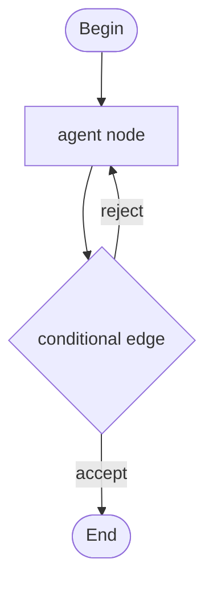

## What a graph is

A graph is a directed, potentially cyclic workflow made up of nodes connected by edges. Each node is a unit of work: an agent turn, a direct tool call, or a data-shaping operation like fan-out or aggregation. Edges carry the result of one node into the next.

The key idea is that a graph encodes structure instead of squeezing multi-step reasoning into a single long prompt. When work splits cleanly into stages (research, then critique, then rewrite) a graph makes those stages explicit, each with its own agent, its own tools, and its own context window.

Primer's graph engine runs a Pregel-style superstep loop: it computes the set of nodes ready to run, executes all of them concurrently, records each node's output into a shared context, evaluates outgoing edges to compute the next frontier, and repeats until the ready set drains, a cap is hit, or a failure terminates the run.



## Graph sessions

A graph does not run by itself. It runs as a workspace session bound to the graph: the session carries the initial input (`graph_input`), the workspace its agents can read and write, and the full run state across every superstep. A worker picks up the session and drives the graph to completion. You create that session only after the graph is built, so "running a graph" always means "starting a session on it."

Per-node state is committed to the workspace's `.state/graphs/<session_id>/` tree after every superstep, so runs survive worker restarts and every turn is recoverable.

## When to use a graph

Use a graph when work splits cleanly into stages and you want those stages to be distinct, inspectable, and composable. The classic pattern is a producer-and-judge loop: one agent drafts, another critiques, the conditional edge loops back until the judge accepts, then an End node collects the final output.

Use a single agent for one continuous conversation. Graphs are overhead when the task is a single turn.

## Node kinds at a glance

| Kind | `kind` value | Purpose |
|---|---|---|
| Begin | `begin` | Entry point; receives the graph's initial input. Every graph needs exactly one. |
| End | `end` | Sink; renders the final output template. At least one must be reachable from Begin. |
| Agent | `agent` | Runs a stored agent with a configurable input template. The main workhorse. |
| Subgraph | `graph` | Delegates to another stored graph (recursive composition). |
| Fan-out | `fan_out` | Dispatches the current state to multiple downstream nodes in parallel. |
| Fan-in | `fan_in` | Waits for all parallel branches to finish and aggregates their outputs. |
| Tool call | `tool_call` | Calls a platform tool directly without an agent turn. |

```ref:graphs/graphs
Build a graph on the visual canvas: add nodes, wire edges, validate, and save.
```

```ref:graphs/graph-node-types
Every node kind: configuration fields, behavior, and examples.
```

```ref:graphs/graph-templating
How Jinja2 templates in nodes access upstream outputs and graph input.
```

```ref:workspaces/workspaces-and-sessions
How sessions are created, how graph_input is validated, and how runs are inspected.
```
