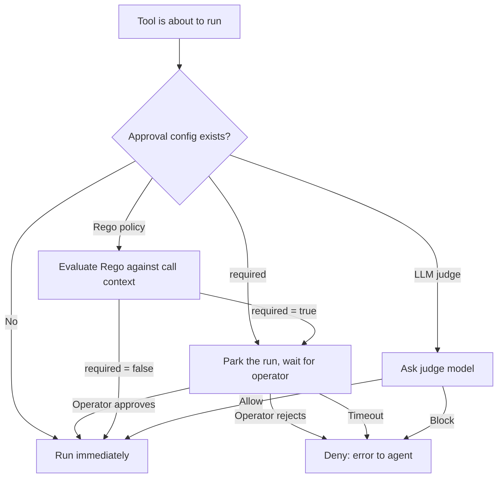

## Concept

Tool approval is an **opt-in** pre-dispatch gate. By default every tool call is allowed and runs immediately. A tool only stops for approval once you have explicitly added an approval configuration for its `(toolset_id, tool_name)` pair. With no configuration in place the gate is a no-op: primer looks up the pair, finds nothing, and dispatches the call.

Every time a tool is about to run, primer checks whether **any approval configuration** has been registered for that `(toolset_id, tool_name)` pair. When none exists the tool runs immediately. When one exists, it becomes the decision-maker: should this particular call proceed or be denied?

The gate is not the same as removing a tool from an agent. The tool remains available to the agent's model; approval decides, call by call, whether execution is permitted. A single configuration can allow most calls and block only the ones that match a specific condition.

Mechanically, a blocked call parks the run the same way a yielding tool does. The worker releases its capacity lease, freeing compute, and the run stays in storage until the gate resolves. If no resolution arrives within the configured timeout the gate closes and the call is treated as denied.

### The three approval strategies

An approval configuration picks exactly one strategy.

**Required.** The gate always waits for a human operator to respond. The pending call is surfaced so the operator can see what tool is about to run, which arguments it was given, and which agent and session triggered it. The operator approves or rejects. Approved calls execute; rejected calls produce a clean error that the agent can reason about. No automated path can bypass a required gate.

**Rego policy.** A small Open Policy Agent policy, written in Rego and stored with the configuration, evaluates the call arguments against the call context. The policy must produce a single boolean result: `required := true` means gate and wait; `required := false` means allow immediately. The evaluation is deterministic and synchronous. No human is involved unless the policy routes to a required gate. For example, a policy that gates only calls whose arguments include a sensitive value will allow all other calls to pass without delay.

**LLM judge.** A designated model evaluates a judge prompt describing the call and returns allow or block with a short reason. This strategy is probabilistic: the same call could produce different outcomes across runs. The judge's decision and its reason are recorded on the pending approval row so operators can audit why a call was allowed or blocked.

### Decision flow



### Approval and MCP

When primer acts as an MCP server, it re-checks the approval configuration on every `tools/call` request, using the same engine as the agent/session path. If a tool's configuration resolves to `required`, the call is **refused** rather than dispatched. This is an intentional hard boundary: the MCP v1 protocol has no park-and-resume surface where a human or judge can weigh in, so dispatching the call would silently bypass the gate the operator configured. The tool returns a `not_exposed` error with reason `approval_required`. The operator must either remove the configuration, change it to Rego or LLM-judge so it can resolve without a human, or invoke the tool via a session where the gate can park and wait.

### Approval lifecycle

Approval configurations are additive and reversible. A configuration can be disabled without deleting it, which restores the tool to immediate dispatch. Re-enabling reinstates the gate on the next call. Deleting removes the gate entirely. None of these changes require a restart, and none affect calls that are already parked; those resolve under the configuration that was in effect when they parked.

## Configuration

```embed:approvals
```

The Approvals page is a single **records** view. It lists every approval record, with controls to sort **by time** and **by status**, and a status badge on each row (pending, approved, rejected, timeout, cancelled). It polls automatically every five seconds. There is no global "Policies" tab: approval gates are configured **per tool**, not in a shared list, so the page links you to the Tools page when you want to add or edit a gate.

```callout:note
The view shows two kinds of record together. A **pending** record is a tool call currently parked on a gate (drawn live from parked sessions and chats). A **resolved** record is a decision that has been finalized; every approve, reject, timeout, and cancel is now persisted durably the moment it is made, so the full history stays visible alongside the live pending calls. Sort by status to group them; only pending rows expose the Approve / Reject controls.
```

### Creating an approval configuration

Approval gates live with the tool they protect, on the **Tools** page (left nav, under Toolsets). The simplest possible gate is the `required` strategy: find the tool, add a required gate, and save. From that point every matching call stops for a manual decision.

1. Open the **Tools** page in the left nav.
2. Find the tool you want to gate (use the search and filter controls). The **Approval** column shows the current gate, or a dash if there is none.
3. Click **Add** in that tool's row (it reads **Edit** if a gate already exists). The configuration modal opens pre-filled with the tool's toolset and tool name.
4. Set the approval type to **Required**.
5. Enter a unique **id** (for example, `approve-stripe-refund`).
6. Optionally set a **timeout** in seconds. If omitted, the global yield cap applies.
7. Click **Create policy**. The tool's Approval column now shows the gate.

That is the minimal configuration required to make a tool gated. The other two strategies (Rego and LLM judge) replace the manual hold with an automated decision, and are documented below.

### Rego input reference

When the approval type is **Policy (Rego)**, the engine evaluates your policy against a single `input` document built from the call context. These are the only fields available; reference them as `input.<field>`.

```code-tabs:json
--- json
{
  "tool_name": "exec",
  "toolset_id": "workspaces",
  "arguments": {
    "workspace_id": "prod-workspace",
    "command": "rm -rf /data"
  },
  "agent_id": "ops-runner",
  "session_id": "ses-7f2a1c",
  "chat_id": null,
  "requested_at": "2026-06-14T09:31:00+00:00"
}
```

| Field | Type | Meaning |
|---|---|---|
| `tool_name` | string | Bare tool name as registered in the provider catalogue. |
| `toolset_id` | string | Toolset the tool belongs to (for example `workspaces`, `system`). |
| `arguments` | object | The exact arguments the agent passed to the tool. |
| `agent_id` | string or null | Agent that requested the call, if any. |
| `session_id` | string or null | Session the call originated in, if any. |
| `chat_id` | string or null | Chat the call originated in, if any. |
| `requested_at` | string | ISO 8601 UTC timestamp of when the call was requested. |

The same `input` document is also handed to the LLM judge as the user message, so a judge prompt can reason about any of these fields too.

### Rego policy example

The policy must define a boolean `required`. An optional string `reason` is recorded on the pending row. The example below allows all calls through except `exec` calls that target the production workspace, which park for operator approval:

```code-tabs:rego
--- rego
package primer.approval

default required := false

# Gate exec calls that target the production workspace.
required if {
	input.tool_name == "exec"
	input.arguments.workspace_id == "prod-workspace"
}

reason := "exec against prod-workspace requires operator sign-off" if {
	required
}
```

Save the configuration with **type = Policy (Rego)**, **toolset = workspaces**, **tool name = exec**, and the Rego above. Now `workspaces__exec` calls targeting `prod-workspace` park for approval; calls to any other workspace pass through immediately.

```callout:info
Rego policies fail closed. A bug or syntax error in the policy body causes the gate to treat the call as `required` (human review) rather than silently allowing it.
```

### LLM-judge example

When the approval type is **LLM judge**, you select a provider and model (from those already configured under LLM Providers) and write a judge prompt. The prompt is sent as the system message; the `input` document (the same shape shown above) is appended as the user message. The judge must return a verdict with a boolean `required` and an optional `reason`.

Configuration shape:

```code-tabs:json
--- json
{
  "id": "judge-shell-commands",
  "toolset_id": "workspaces",
  "tool_name": "exec",
  "enabled": true,
  "approval": {
    "type": "llm",
    "provider_id": "primary-llm",
    "model": "claude-haiku-4-5",
    "prompt": "You are a security reviewer for an autonomous agent. You will receive a JSON document describing a shell command the agent wants to run in a workspace. Set required=true when the command is destructive (deletes data, drops databases, rewrites history, or exfiltrates secrets) or targets a production workspace; otherwise set required=false. Always include a one-sentence reason."
  }
}
```

If the judge call fails, the gate fails closed: a failed verdict blocks the tool the same way a Rego error does.

### Editing or disabling a configuration

On the **Tools** page, a gated tool's row shows its gate in the **Approval** column and an **Edit** button. Click **Edit** to reopen the configuration modal with all fields pre-filled. The **id** field is locked after creation; every other field is editable. To pause a gate without deleting it, edit the configuration and clear the **Enabled** toggle; re-enable it later from the same modal. Deleting the configuration removes the gate entirely and returns the tool's Approval column to a dash.

```callout:warning
Deleting a configuration that currently has parked sessions does not auto-resolve those sessions. The parked calls stay parked until you decide them manually, then the session continues.
```

## Walkthrough: gate a destructive system tool

This walkthrough puts a required approval on `system__delete_agent` so no agent can delete another agent without an operator sign-off.

1. Open the **Tools** page and find the `delete_agent` row in the `system` toolset.
2. Click **Add** in that row. The configuration modal opens with **toolset** set to `system` and **tool name** set to `delete_agent`.
3. Set **id** to `guard-delete-agent` and **type** to `Required`.
4. Set **timeout** to `3600` (one hour) so parked calls do not block indefinitely.
5. Click **Create policy**. The tool's Approval column now shows the gate.

Now, the next time any agent calls `system__delete_agent`:

1. The call parks. The agent's turn pauses.
2. The call appears in the **Approvals** records view with a **pending** badge. Sort by status to bring pending records to the top.
3. You review the call arguments (which agent id is about to be deleted, which session triggered the call).
4. Click **Approve** to release the call; the session resumes and the delete executes.
5. Or click **Reject**, type a reason, and click **Send rejection**. The agent receives a clean error and can decide how to proceed.

The amber banner in the session or chat detail view also shows the Approve and Reject controls while the call is parked.

```callout:danger
Rejecting a tool call is not a retry. The agent receives an error message. If the agent's system prompt does not anticipate a rejection it may stall or end unexpectedly. Test the reject path in a development session before enabling a required configuration in production.
```

```ref:toolsets/toolsets-system
The eight built-in toolsets and the tools they contain.
```

```ref:features/mcp-server
Primer as an MCP server: how allowlist and approval combine to control what external clients can call.
```
