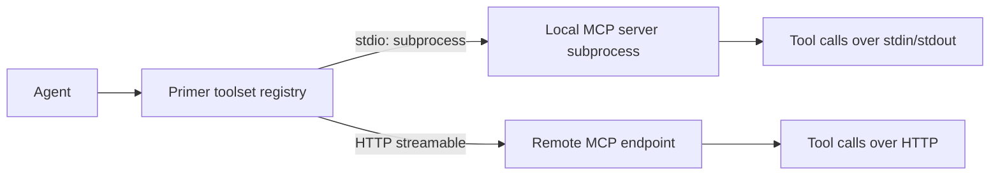

## Concept

Alongside the built-in system toolsets, primer lets you register **external toolsets**: tool collections that live outside primer and are pulled in over a transport. An external toolset appears in the toolset list next to the built-in ones, and any agent can be bound to it; the agent's effective tool list then includes both the external tools and any other toolsets the agent has.

Today the one external-toolset kind is **MCP**. The same registration model is what any future external-provider kind would follow: register the source once, and any number of agents can bind to it.

### MCP toolsets

**MCP (Model Context Protocol)** is an open standard for exposing tools to LLMs. An MCP server advertises a list of callable functions; an MCP client (primer, in this case) connects, lists those functions, and forwards agent calls to them.

Primer treats each registered MCP server as a **toolset of kind `mcp`**. Once registered, the MCP toolset appears in the toolset list alongside the built-in toolsets, and any agent can be bound to it. This design keeps the integration surface clean: the operator registers an MCP server once, and any number of agents can bind to it. The server does not need to know which agent is calling; primer handles authentication, transport, and the call routing.

### Transports

Primer supports two MCP transports.

**stdio**: primer launches the MCP server as a subprocess and speaks MCP over its standard input and output. The subprocess has a per-dispatch lifetime: it is started (and the MCP init handshake run) at the beginning of each dispatch and closed when that dispatch finishes, rather than kept alive for the provider's lifetime. A single dispatch that issues several tool calls reuses the one subprocess; across dispatches a fresh subprocess is started. This keeps behaviour correct when dispatches land on different workers, at the cost of re-running the handshake per dispatch. Useful for local or containerised MCP servers where you have binary access. The command and its arguments are specified as an argv list; environment variables can be injected as key-value pairs.

**HTTP (streamable)**: primer connects to a remote MCP endpoint over the streamable-HTTP transport. A new HTTP session is opened for each tool call (the MCP SDK has no long-lived equivalent for stateless HTTP MCP). Useful for hosted or remote MCP servers. Supports static headers (for example, an `Authorization` header) and an optional OAuth 2.1 (PKCE) flow for servers that return a 401 on unauthenticated requests.



### Stdio command allowlist

In multi-tenant or security-sensitive deployments, an operator can configure an `allowed_stdio_commands` allowlist on the primer instance. When set, primer refuses to launch any stdio MCP server whose command is not in the allowlist, even if a user creates a Toolset row for it. The allowlist is enforced at dispatch time.

### OAuth preflight for HTTP toolsets

When an HTTP MCP toolset has an `oauth` block configured, primer performs OAuth 2.1 (PKCE) automatically. If a request to the MCP server returns a 401, the adapter raises an `auth-required` error that surfaces to the caller. Once the OAuth flow is complete (via `complete_oauth`), the adapter caches the bearer token and includes it on subsequent requests. Passing a `principal` on `list_toolset_tools` or `call_tool` scopes the cached token to a specific end-user identity.

## Configuration

```embed:toolsets
```

To register an MCP toolset:

1. Open **Toolsets** in the left nav.
2. Click **New toolset**.
3. Enter a unique **id** for the toolset (for example, `github-mcp`). This id is how agents and the console refer to it.
4. Choose **provider = mcp**.
5. Choose a **transport**:

   | Transport | When to use |
   |---|---|
   | `stdio` | Local binary or container; you have filesystem access to the server process. |
   | `http` | Remote or hosted MCP endpoint reachable over HTTP. |

6. Fill in the transport-specific fields:

### stdio fields

| Field | Required | Notes |
|---|---|---|
| `command` | Yes | The full argv list. Example: `["npx", "-y", "@modelcontextprotocol/server-github"]`. The first element must be in the allowlist when one is configured. |
| `env` | No | Environment variables injected into the subprocess. Pass API keys here rather than in the command string. |

### HTTP fields

| Field | Required | Notes |
|---|---|---|
| `url` | Yes | Base URL of the MCP endpoint. Example: `https://mcp.example.com`. |
| `headers` | No | Static headers sent on every request. Common use: `Authorization: Bearer <token>`. |
| `oauth` | No | OAuth 2.1 config block. Set when the server requires OAuth rather than a static token. |

7. Click **Save**. The toolset is now registered and visible in the toolset list.

### Binding the toolset to an agent

After saving the MCP toolset, go to the agent's **Tools** tab and add it to the toolset list. The agent can then select individual tools from the MCP server or take all of them.

## Walkthrough: register a local MCP server

This walkthrough registers the GitHub MCP server as a stdio toolset and binds it to an agent.

1. Install the MCP server locally if needed: `npm install -g @modelcontextprotocol/server-github` (or use `npx`).
2. In primer, open **Toolsets** and click **New toolset**.
3. Set **id** to `github-mcp` and **provider** to `mcp`.
4. Set **transport** to `stdio`.
5. Set **command** to `["npx", "-y", "@modelcontextprotocol/server-github"]`.
6. Set **env** to `{"GITHUB_PERSONAL_ACCESS_TOKEN": "<your-token>"}`.
7. Click **Save**.
8. Open an agent, go to the **Tools** tab, and add `github-mcp` to its toolset list.
9. Start a session with that agent and ask: "List the open pull requests in my organisation's main repo."

The agent calls the GitHub MCP server's `list_pull_requests` tool (or equivalent) through primer and returns the results.

### Walkthrough: register a remote HTTP MCP server

1. Open **Toolsets** and click **New toolset**.
2. Set **id** to `remote-mcp` and **provider** to `mcp`.
3. Set **transport** to `http`.
4. Set **url** to the server's endpoint, for example `https://mcp.acme.com/v1`.
5. Optionally add a static `Authorization` header under **headers**.
6. Click **Save**.


```ref:toolsets/toolsets-system
The eight built-in toolsets and how to explore tools with list_toolset_tools and call_tool.
```

```ref:features/mcp-server
Primer as an MCP server: exposing a curated subset of its own tools to external clients.
```
