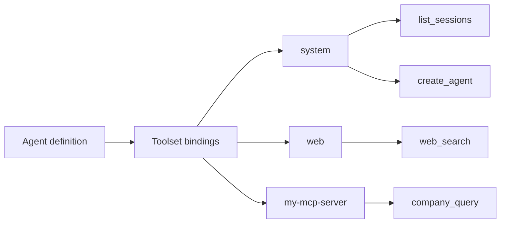

## Concept

A **tool** is a single callable function (`read_file`, `web_search`, `list_sessions`). A **toolset** is a named collection of related tools: `system`, `web`, `workspaces`, `misc`.

The two levels serve different roles:

- An agent is bound to **toolsets**. Binding a toolset grants the agent access to every tool inside it.
- An agent can also declare individual **tool ids** to restrict its context to a subset of a toolset's tools.

This split matters because context size matters. An agent bound to only the tools it needs exposes a smaller, cleaner schema to the model than one that carries the entire platform surface. Toolsets answer the question "what kind of work can this agent do?" (browse the web, manage sessions, read workspace files). Individual tool ids answer "which exact actions within that kind?" (only read, not write).

### How binding gates what an agent can call

At session start, primer assembles the agent's effective tool list from its bindings. Only the tools in that list are presented to the model; the rest of the platform surface is invisible to it. An agent cannot call a tool it was not bound to, regardless of how it phrases the request.



Binding determines what the agent can request. The approval layer (a separate mechanism) determines what actually executes.

### The eight reserved toolsets

Primer ships eight built-in toolsets that are always available without registration. They are reserved by id; you cannot create a user toolset with the same id.

| Toolset | What it covers |
|---|---|
| `system` | Full CRUD over every platform entity (agents, graphs, collections, providers, toolsets, channels, workspaces, triggers, approval policies). Plus meta-tools: `list_toolset_tools`, `call_tool`, `invoke_agent`, `switch_to_agent`, and the yielding `ask_user` (chat-capable; soft-yields on a chat surface). |
| `web` | Web search (`web_search`), raw HTTP fetch (`web_fetch`, `http_request`). Requires a web search provider to be configured for `web_search`. |
| `workspaces` | The orchestration toolset: manage workspaces from the outside (provider, template, workspace, and session CRUD, plus remote file and log tools). Bound explicitly, like any toolset, by agents that orchestrate other workspaces and sessions. (Separately, the in-workspace access tools `ls`, `read`, `write`, `edit`, `glob`, `grep`, and `exec` are auto-registered with every agent that runs in a workspace session; those are not part of this toolset. See the Workspace toolset page.) |
| `misc` | Portable stateless utilities: `get_datetime`, `inform_user`, `uuid_v4`, `hash`, `calculate`. |
| `search` | Semantic search over internal collections: `search_agents`, `search_graphs`, `search_collections`, `search_tools`, `search_ai_docs`. These tools are only enabled when the internal search subsystem (internal collections) is enabled and active; until then they are unavailable. |
| `trigger` | Manage triggers and subscriptions (trigger and subscription CRUD, plus `fire_now`). |
| `harness` | Lifecycle management for harnesses (`harness__list`, `harness__get`, `harness__register`, `harness__fetch`, `harness__install`, `harness__sync`, `harness__uninstall`, `harness__update`, `harness__update_overrides`). |
| `workspace_ext` | The workspace-only yielding tools (`sleep`, `watch_files`, `invoke_graph`, `subscribe_to_trigger`). Bound explicitly on an agent, but registered only when the agent runs in a workspace session; suppressed when the agent is invoked on a chat (keeps these heavy yielding tools out of chat context). |

### Yielding tools

Yielding tools are a first-class concept that makes event-driven agentic AI possible. When an agent calls a yielding tool, the current turn is **paused and parked**: it does not hold a connection open and it does not block a worker. The run is resumed later, when the awaited event fires (a human answers a question, an approver makes a decision, a watched file changes, a trigger fires). This lets a single agent wait on real-world events for seconds, minutes, or days without consuming a worker the whole time.

Key yielding tools:

| Tool | Toolset | Resumes when |
|---|---|---|
| `system__ask_user` | `system` | A human answers via the pending questions queue (degrades to a conversational turn on a chat surface) |
| The tool-approval gate | (gate, not a tool) | An approver makes an approve/reject decision |
| `workspace_ext__watch_files` | `workspace_ext` | A watched file changes |
| `workspace_ext__subscribe_to_trigger` | `workspace_ext` | The named trigger fires |
| `workspace_ext__sleep` | `workspace_ext` | A timer event after N seconds elapses |
| `workspace_ext__invoke_graph` | `workspace_ext` | A nested graph completes (parks on its human-in-the-loop steps) |

`system__ask_user` lives in the `system` toolset and works on both chats and workspace sessions; on a chat surface it soft-yields (degrades to a conversational turn) rather than parking. `system__switch_to_agent` is the chat handoff (also in `system`; see below).

The four `workspace_ext` tools (`sleep`, `watch_files`, `invoke_graph`, `subscribe_to_trigger`) are **workspace-session only**. An agent binds the `workspace_ext` toolset explicitly on its Tools tab, but the tools are registered with the model only when the agent runs in a workspace session. When the same agent is invoked on a chat, the `workspace_ext` tools are suppressed (not registered in the model's tool context). This keeps these heavy yielding tools out of chat context.

### Switching agents

`system__switch_to_agent` is **not** a yielding tool: it does not wait for an external event. It is a chat **handoff**. Calling it ends the current turn and the named agent takes over the **same chat** on the next turn. Use it to transfer control of a conversation from one agent to another (for example, escalating to a specialist agent) rather than to wait on an event.

### Exploring the tool catalog from an agent

Two meta-tools in the `system` toolset let an agent discover and call any tool at runtime without carrying the full catalog in its context:

- **`system__list_toolset_tools`**: enumerate every tool a given toolset exposes, including its arguments schema and description. Call this on an unfamiliar toolset before dispatching to it.
- **`system__call_tool`**: meta-dispatch: invoke any tool from any toolset by toolset id and tool name, forwarding arguments directly. The dispatched tool's output and error status are passed through unchanged.

This is the **search-and-invoke pattern**: an agent searches for a tool by description via `search__search_tools`, finds the right one, then calls it through `system__call_tool`, all without its prompt carrying every tool definition up front.

## Configuration

Tools are not configured on a "toolsets" page. They are bound per agent, on the agent's Tools tab (Agents > the agent > Tools). The toolset just exists; each agent declares which toolsets (and optionally which individual tools) it uses.

```embed:agents-page
```

### Binding toolsets

1. Open **Agents** in the left nav.
2. Click the agent you want to configure, or click **New agent**.
3. Go to the **Tools** tab.
4. Use the toolset selector to add one or more toolsets. The selector shows all registered toolsets (built-in and MCP).
5. Optionally, after adding a toolset, expand it and check individual tool ids to restrict the agent to a subset. Leaving the list empty means "all tools in this toolset."
6. Click **Save**.

### Tool id syntax

When referencing a tool by its full scoped id (for example, in MCP exposure allowlists or policy configurations), the convention is `toolset_id__tool_id`, using double underscores as a separator; for example `system__invoke_agent`, `system__ask_user`, `search__search_agents`, `web__web_search`.

## Walkthrough: explore a toolset from the console

This walkthrough discovers what tools the `misc` toolset exposes, then calls one of them through a running agent.

1. Open **Agents** and open or create an agent that has the `system` toolset bound to it.
2. Start a new **session** or **chat** with that agent.
3. Ask the agent: "Use `list_toolset_tools` to show me the tools in the `misc` toolset."
4. The agent calls `system__list_toolset_tools` with `{"toolset_id": "misc"}` and returns the tool list including `get_datetime`, `inform_user`, `uuid_v4`, `hash`, and `calculate`.
5. Ask: "Now call `get_datetime` for me." The agent calls `system__call_tool` with `{"toolset_id": "misc", "tool_name": "get_datetime", "arguments": {}}` and returns the current timestamp.

The same pattern works for any registered toolset, built-in or MCP.

```ref:toolsets/toolsets-external
Register external tools via MCP toolsets (stdio and HTTP).
```

```ref:toolsets/toolsets-approvals
Gate tool calls with required, Rego, or LLM-judge approval policies.
```
