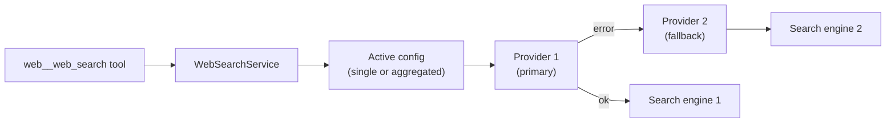

## Concept

Primer agents can search the web through the `web__web_search` tool. Behind that tool is the web search subsystem: a registry of **web search providers** plus an **active configuration** that decides which provider (or ordered list of providers) handles every query.

Four provider backends ship with Primer:

- **DuckDuckGo**: keyless, zero-configuration. Primer auto-creates a reserved `DuckDuckGo` row and points the active configuration at it on first boot, so web search works immediately without any API keys.
- **Tavily**: a search API designed for LLM agents. Requires a Tavily API key.
- **Firecrawl**: a crawl-and-extract service. Requires a Firecrawl API key.
- **Exa**: a neural search API. Requires an Exa API key.

The **active configuration** controls how providers are used at runtime. It has two modes:

- **Single**: route every query to one named provider. This is the default out of the box (pointing at DuckDuckGo).
- **Aggregated**: try an ordered list of providers. If the first provider fails (quota, transient error, or misconfiguration), the service moves to the next. Only when every provider in the list fails does the tool return an error to the agent.



The tool returns up to 25 hits per query, each with a title, URL, and snippet. Agents receive the hits as a JSON list and decide how to use them.

## Configuration

### Provider fields

| Field | DuckDuckGo | Tavily | Firecrawl | Exa |
|---|---|---|---|---|
| ID | required | required | required | required |
| API key | none | required | required | required |

IDs are immutable after creation. API keys are redacted in list and get responses; the plaintext key is stored internally.

DuckDuckGo has no configuration fields beyond the ID. The reserved `DuckDuckGo` row cannot be deleted (returns 403) and its ID cannot be reused (returns 409).

### Active configuration fields

| Field | Notes |
|---|---|
| Mode | `single` or `aggregated`. |
| Provider ID (single mode) | The ID of the provider to use for all queries. |
| Provider IDs (aggregated mode) | An ordered list of provider IDs tried in priority order. Duplicates are deduplicated while preserving order. |

Changing the active configuration takes effect within 5 seconds for all running workers (the service caches the singleton with a 5-second TTL). You cannot delete a provider while it is referenced by the active configuration (returns 409).

## Walkthrough

### Add a Tavily provider

1. In the console, open **Web Search** in the left navigation.
2. In the **Providers** section, click **Add provider**.
3. Choose **Tavily** from the provider type dropdown.
4. Enter an ID (e.g. `tavily-main`) and paste your Tavily API key.
5. Click **Save**.

```embed:web-search
```

The provider row is saved and a **Test** button appears next to it. Click **Test** to fire a live query (`primer`, 1 result) and verify the key is valid.

### Switch the active provider

1. In the **Active configuration** card at the top of the Web Search page, click **Edit**.
2. Set mode to **Single** and choose your new provider ID from the dropdown.
3. Click **Save**.

Agents running in-flight pick up the new provider within 5 seconds.

### Set up a fallback chain

1. In the **Active configuration** card, click **Edit**.
2. Set mode to **Aggregated**.
3. Add provider IDs in priority order (e.g. `tavily-main`, `DuckDuckGo`).
4. Click **Save**.

If Tavily is unavailable or returns an error, the service automatically retries with DuckDuckGo before surfacing an error to the agent.


```ref:toolsets/toolsets-system
```
