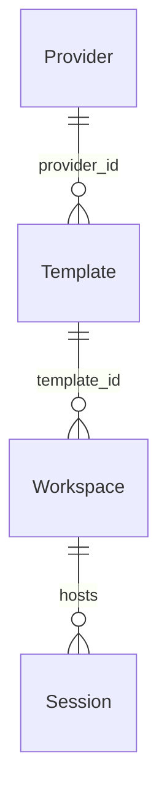
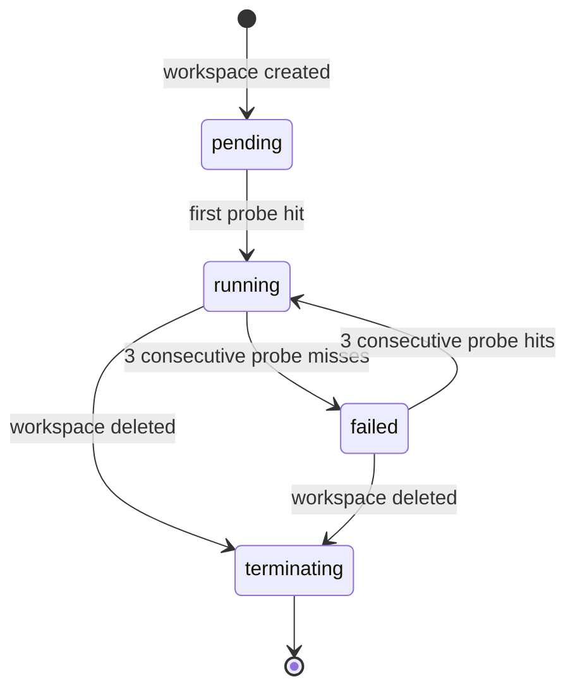

## What workspace providers are

A workspace gives an agent a real place to work: a filesystem it can read and
write, a shell it can run commands in, and a git-backed `.state/` history that
records every assistant turn as a commit. The workspace provider is the backend
configuration that tells primer which runtime to use and how to reach it.

Three concepts share the workspace namespace; knowing them up front prevents
confusion:

- **Provider**: the backend configuration: which runtime (local filesystem,
  container daemon, Kubernetes cluster) and how to reach it. Each provider is
  an id-keyed row (like an LLM provider), and you can register as many as you
  want, including several of the same backend type. For example, two
  Kubernetes providers can point at two different clusters, or two container
  providers at two different Docker daemons.
- **Template**: the materialisation recipe that references a provider:
  which image or base path, environment variables, initial files, and init
  commands. Many templates can reference one provider.
- **Workspace instance**: the live, materialised sandbox created from a
  template. Many instances can be created from one template; each instance
  hosts one or more sessions.



### Three backends

Primer ships three backends that all satisfy the same workspace contract:

| Backend | Where the filesystem lives | Where commands run |
|---|---|---|
| Local | A directory on the host | The host process |
| Container | A volume inside a Docker or Podman container | Inside the container |
| Kubernetes | A PVC attached to a StatefulSet pod | Inside the pod |

**Local** is the simplest choice and requires only the host filesystem and
`git`. It is bootstrapped automatically on first start with the reserved id
`local`; a default template pointing at it is also created. Use the local
backend for development and single-machine deployments.

**Container** runs each workspace in an isolated Docker or Podman container.
File operations and shell commands travel over a persistent WebSocket to an
in-container `primer-runtime` server. The connection stays open for the
lifetime of the workspace so file ops are sub-millisecond and shell exec
returns at inotify-push latency rather than waiting for a new `docker exec`
per call. Use the container backend when you need network isolation,
reproducible images, or resource caps per workspace.

**Kubernetes** runs each workspace as a StatefulSet pod with a PersistentVolume
Claim for durability. The same WebSocket runtime protocol is used as for
container workspaces. Use the Kubernetes backend for production deployments
where you need cluster scheduling, auto-recovery, and namespace-level network
policy.

The provider stores only connection and reachability parameters. Image
selection, environment variables, init commands, and resource limits all live
on the template, so one provider can back many differently configured templates.

### Lifecycle and probe



A newly created workspace starts in the `pending` phase and is promoted to
`running` on its first successful probe ping. A background probe pings every
running workspace on a configurable interval (default 30 seconds). Three
consecutive missed pings flip the workspace to `failed` and end every session
on it with reason `workspace_lost`. Three consecutive successful pings restore
it to `running`. The phase machine is driven by the probe.

## Configuration

### Local provider fields

The local provider requires only a `root_path` where workspace directories are
created. The auto-bootstrapped `local` provider uses a default path and is
protected from mutation through the UI or API: re-creating the reserved id
returns `409`, and updating or deleting it returns `403`.

If you need a second local provider pointing at a different directory, register
it with `provider = "local"` and a different `root_path`.

### Container provider fields

| Field | Description |
|---|---|
| **Runtime** | `docker` (real); `podman` and `containerd` are config-accepted stubs that raise `ConfigError` at use time |
| **Connection** | `socket` (path to a Unix socket; default `/var/run/docker.sock`) or `remote` (a `tcp://` daemon URL with optional TLS) |
| **Reachability** | How the platform reaches the runtime server inside the container: `host_port` (bind a host port, for host-side platforms) or `bridge_network` (container-to-container DNS on a named Docker network) |

The platform mints a per-workspace bearer token and injects it as
`PRIMER_RUNTIME_TOKEN` when creating the container. The token is stored on the
workspace row so the platform can re-attach after a restart without re-creating
the container.

### Kubernetes provider fields

| Field | Description |
|---|---|
| **Connection** | `in_cluster` (when primer runs inside the cluster), `kubeconfig` with a path, or `service_account_token` (explicit apiserver URL + token) |
| **Namespace** | The Kubernetes namespace where StatefulSets and PVCs are created |
| **Reachability** | `in_cluster` (pod-to-pod DNS), `ingress` (via a templated ingress URL), or `gateway_httproute` (via a pre-created Gateway API HTTPRoute) |

The token is stored in a per-workspace Kubernetes Secret and recovered from
it on re-attach.

## Walkthrough: register a container provider

1. Open **Workspaces** in the left nav.
2. Click the **Providers** tab at the top of the page.
3. Click **New provider**.

```embed:workspace-provider-create
```

4. Select **Container** as the provider type.
5. Set **Runtime** to `docker`.
6. Under **Connection**, choose **Socket** and confirm the socket path
   (`/var/run/docker.sock` is the default on Linux).
7. Under **Reachability**, choose **Host port**. The platform will bind a
   random high port for each workspace's runtime server.
8. Click **Create provider**. The provider row appears in the list.

To register a Kubernetes provider, choose **Kubernetes** in step 4, set
**Connection** to `in_cluster` (or `kubeconfig` with the path to your
kubeconfig file), enter the target namespace, and choose the reachability
mode that matches your cluster topology.

The local provider (`local`) is already registered on first boot. You do not
need to create it, but you may create additional local providers pointing at
different directories.


```ref:workspaces/workspace-templates
Author templates that materialise workspaces from a provider and configure
the image, environment variables, init commands, and initial files.
```

```ref:workspaces/workspaces-and-sessions
Sessions run on workspace instances; one agent or graph per session,
many sessions per workspace.
```

```ref:workspaces/workspace-toolset
The workspace toolset agents use to manage providers, templates,
workspaces, and sessions programmatically.
```

```ref:reference/api-workspaces
REST API reference for workspace providers, templates, workspace instances,
the file sub-API, and the diagnostic exec endpoint.
```
