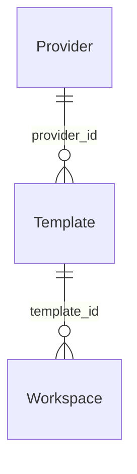

## What workspace templates are

A workspace template is the declarative recipe that tells primer how to
materialise a workspace. It references a provider (the backend runtime) and
carries everything that makes a workspace environment specific: which
container image or host directory to use, which environment variables to inject,
which files to seed, and which commands to run once at creation time.

The separation between provider and template is intentional. A provider is a
deployment-level configuration (how to reach Docker, where local workspaces
live). A template is a workspace-level configuration (what the workspace looks
like). One provider can back many templates; one template can produce many
workspace instances.



### What a workspace instance gets from its template

When a workspace is created, the platform resolves the template at that moment
and materialises the environment. The resulting workspace carries a snapshot of
the template it was created from. Later changes to the template do not affect
already-running workspaces; only future creates see the update.

The materialisation process:

1. Merge the template fields with any per-instance `overrides` (env layer on
   top, files extend, init commands extend).
2. Resolve every `FileSource` to raw bytes in the platform process.
3. Write the resolved files into the workspace.
4. Run any `init_commands` sequentially inside the workspace.
5. For container and Kubernetes backends: start the `primer-runtime` image,
   inject the per-workspace bearer token, open the WebSocket connection.

Packages and dependencies should be baked into the container image rather than
installed at materialisation time. The `init_commands` field exists for
lightweight per-workspace setup (copying configs, creating directories); using
it for package installs slows materialisation and makes it non-deterministic.

### Ephemerality

Workspaces are not ephemeral by default. They persist until explicitly deleted.
If the use case calls for a fresh sandbox per run, create a new workspace
instance per run and delete it on completion. The `overrides` mechanism lets
you inject per-run env vars and files without modifying the shared template.

### The state history

Each workspace owns a git-backed `.state/` repo. Every assistant turn that
writes to the workspace is committed with structured trailers recording the
workspace, session, agent, and operation. The commit log is a linear, greppable
audit trail. The `.tmp/` subtree holds oversized tool output; it is per-session
and cleaned up when the session ends. Both `.state/` and `.tmp/` are reserved
and protected from mutation through the file API.

### Multi-session sharing

Multiple sessions can run against the same workspace instance simultaneously.
They share the filesystem, so a producer session can write a file that a
reviewer session reads. Commits from concurrent sessions are serialised by a
workspace-wide lock so git index conflicts cannot occur.

## Configuration

The template form collects the following fields:

| Field | Description |
|---|---|
| **Name / ID** | A unique identifier for this template (for example `python-3.13-default`) |
| **Description** | Optional human-readable note shown in the template list |
| **Provider** | Which registered provider backend materialises instances from this template |
| **Backend** | The backend-specific config (see below) |
| **Environment variables** | Key-value pairs injected into the workspace at materialisation time |
| **Init commands** | Shell commands run once when the instance is first created |
| **Files** | Seed files written into the workspace at materialisation time |
| **State path** | Root of the git-backed state tree (default `.state`) |
| **Tmp path** | Root of the per-session truncation cache (default `.tmp`) |
| **Resource limits** | CPU and memory caps (container and Kubernetes only) |

### Backend fields by provider type

**Local backend**: requires no additional config beyond selecting a local
provider. The workspace root is a subdirectory under the provider's
`root_path`.

**Container backend:**

| Field | Description |
|---|---|
| **Image** | The container image to run (for example `python:3.13-slim` or `primer/workspace-runtime:1.0`) |
| **Entrypoint** | Optional override for the image entrypoint (`entrypoint`), plus optional `user` and `workdir` (default `/workspace`) |
| **Mounts** | `extra_mounts`: host bind mounts to attach (`host`, `container`, `readonly`) |
| **Resource limits** | `cpu_cores` (float) and `memory_bytes` (int) |

**Kubernetes backend:**

| Field | Description |
|---|---|
| **Image** | Container image; must be accessible from the cluster (plus optional `entrypoint`, `args`, `workdir`) |
| **Resource limits** | `cpu_request` / `cpu_limit` / `memory_request` / `memory_limit` as Kubernetes quantity strings (`500m`, `2`, `1Gi`) |
| **PVC size** | `pvc_size`, default `10Gi`; `pvc_access_modes` defaults to `["ReadWriteOnce"]` |
| **Storage class** | `storage_class`, optional; uses the cluster default when omitted |
| **Pod overrides** | `pod_overrides` (deep-merged into the PodSpec), `extra_volumes`, `extra_volume_mounts`. Escalation keys are rejected recursively: `securityContext`, `hostPath`, `hostNetwork`, `privileged`, `runAsUser`, and similar paths |

### File sources

The `files` field is a list of `FileMount` entries, each with a `path`
(the destination inside the workspace) and a `source` discriminated by kind:

- `inline`: content supplied directly in the template
- `url`: fetched from an HTTP URL at materialisation time
- `document`: a primer knowledge document referenced by id
- `secret`: a named secret resolved from the platform secret store

## Walkthrough: create a template and materialise a workspace

1. Open **Workspaces** in the left nav.
2. Click **New workspace**. If no templates exist, click **Create a template
   now** inside the modal to open the template form inline.

```embed:workspace-template-form
```

3. Fill in the template form:
   - **Name**: for example `python-3.13-default`.
   - **Provider**: select the provider that matches your backend (the default
     `local` provider is available without any setup).
   - **Backend**: for local, no extra fields are needed. For container, enter
     an image name. For Kubernetes, enter the image and a PVC size.
   - **Environment variables**: add any key-value pairs the agent or workspace
     commands will need.
   - **Init command**: add lightweight one-time setup (for example
     `mkdir -p data output`). Do not use this for package installs.
4. Click **Create template**. The template row appears in the template list.
   The provider validates that the image or base path is reachable but does
   not spin up any instance yet.

5. Click **New workspace** again (or from the template list, click **Create
   workspace from this template**).
6. In the modal:
   - **Name** (optional): a human-readable label like `research-sandbox`.
   - **Template**: select the template you just created.
7. Click **Create**. The console navigates to the new workspace detail page.

```callout:info
A change to a template does not affect existing instances. Instances keep the
recipe they were created from. To pick up a template change, create a new
instance.
```

The workspace enters the `running` phase once the provider materialises the
sandbox. For local workspaces this is nearly instant. For container and
Kubernetes workspaces it takes a few seconds while the runtime starts.


```ref:workspaces/workspace-providers
Provider types (local, container, Kubernetes) and how to register them.
```

```ref:workspaces/workspaces-and-sessions
How a session binds to a workspace and what the agent can do once inside.
```

```ref:reference/api-workspaces
REST API for workspace templates, workspace instances, file operations, and
the git log surface.
```
