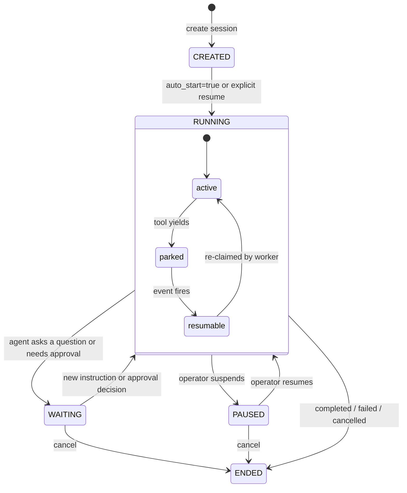

## Workspace instances host sessions

A **workspace instance** is a live, materialised sandbox created from a workspace template: a filesystem the agent reads and writes, a shell it can run commands in, and a git-backed `.state/` history that records every assistant turn as a commit. One instance can host many sessions from different agents or graphs running at the same time; the sessions do not share memory but they do share the instance filesystem. (How instances are backed and configured is covered by their provider and template, linked at the foot of this page.)

A **session** is one run on that instance. The rest of this page is about the session lifecycle: how to start a run, watch its turns, and pause, resume, or cancel it.

## What a session is

A session is one run of one agent (or one graph) on one workspace. It is the right primitive when the work is "do this thing, take as long as you need, here are the tools, tell me when you are done." The operator fires it off, the agent works through turns until it finishes or needs input, and the transcript survives restarts because it lives in the workspace's own `messages.jsonl` file rather than in memory.

The same agent can run many sessions against the same workspace at the same time without sharing memory. Each session owns its own state slot inside the workspace's git-backed `.state/sessions/<session-id>/` directory.

```callout:tip
Think of an agent as a function definition and a session as a single call to that function, with every intermediate step, tool call, and tool result recorded in order.
```

### Sessions vs chats

Sessions run headless under a scheduler. Chats are interactive: each chat turn waits for a human (or another agent) to send a message before proceeding. Both use the same agent loop and the same tool-dispatch machinery, but a chat has a live WebSocket surface for streaming replies turn by turn, while a session streams into `messages.jsonl` and the operator polls or subscribes for results.

| | Session | Chat |
|---|---|---|
| Who drives each turn | The scheduler; agent runs autonomously | A human or external agent sends a message |
| Stopping point | Runs until done, waiting, or paused | Waits for the next user message |
| History store | `messages.jsonl` inside the workspace | Ordered message rows in the database |
| Workspace | Always scoped to one workspace | No workspace attached |

### Turns

A turn is one cycle through the agent loop: the worker claims the session, runs the model, dispatches any tool calls, and persists the results. Each turn produces an ordered list of messages (assistant text, tool calls, and tool results) appended to `messages.jsonl` inside the workspace.

A per-turn audit log (`turns.jsonl`) records a structured boundary event on every start, completion, failure, yield, and resume, so you can trace exactly what happened during each turn without replaying the full message history.

### Relationship to workspaces

A session is always scoped to one workspace. The workspace provides the filesystem the agent reads and writes. The session's message history and audit log live inside that workspace's `.state/sessions/<session-id>/` directory, so the history travels with the workspace if it is moved or archived.

A workspace can host many sessions from different agents or graphs running at the same time. Sessions do not share memory, but they do share the workspace filesystem, so concurrent sessions can read and write the same files.

## Session lifecycle

A session moves through five statuses:



**CREATED**: the row exists but no worker has been told to run it yet. This is the state when `auto_start=false` on create. The session stays in CREATED until you explicitly resume it.

**RUNNING**: a worker holds a lease and a turn is in flight. Within RUNNING, a session can temporarily park when a tool yields (waiting for a trigger, an external event, or an approval decision); parking releases the worker lease so no compute is consumed while the session waits.

**WAITING**: the agent reached a stopping point and needs external input, for example because the assistant ended a turn with a trailing question or hit a model stop limit. The session stays in WAITING until you provide a response via the API. (Calls to `system__ask_user` and approval gates are handled by the parking mechanism inside RUNNING, described below, rather than by moving the session to WAITING.)

**PAUSED**: an operator requested suspension. The session resumes on demand.

**ENDED**: terminal. Ended sessions carry a reason: `completed`, `failed`, `cancelled`, `workspace_lost`, or `force_deleted`.

### The auto_start flag

When you create a session via the API or MCP tools, the `auto_start` field controls whether the session starts immediately:

- `auto_start=true` (the default for trigger-created sessions and for the MCP/workspace toolset create tool): the session transitions directly from CREATED to RUNNING and a worker picks it up at once.
- `auto_start=false` (the default for the REST create endpoint): the session stays in CREATED until you call the resume endpoint. This lets you inspect or adjust the session before it runs, or schedule it to start at a specific moment.

The console always shows the current status, so you can see whether a session is waiting to be started or already running.

### Pause, resume, and cancel

All three controls are durable. If the API process restarts between the request and the next worker claim, the flag survives in the database and the worker honours it on the next claim.

- **Pause**: holds the session at the next turn boundary. The worker releases the slot. The session moves to PAUSED. Use this to inspect state before the next turn runs.
- **Resume**: reverses a pause or activates a CREATED session. The session re-enters the queue and a worker picks it up at the next turn.
- **Cancel**: moves the session to ENDED immediately at the next turn boundary. Any in-flight tool call receives a cancellation error. The transcript is preserved and readable after cancellation. Cancel is terminal; sessions cannot be restarted after they end.

## Walkthrough: start and monitor a session

1. Navigate to **Sessions** in the left nav.
2. Click **New session** (top-right of the filter bar).
3. Select the agent (or graph) to run, the workspace to run it in, and provide the initial instructions.
4. Click **Start**. The new session row appears at the top of the list with status `created`, then transitions to `running` as a worker picks it up.

```embed:sessions-list
```

The filter bar supports:

- **Status chips**: click one or more statuses to filter (created / running / waiting / paused / ended). Active-status chips are highlighted.
- **Agent** dropdown: narrow to sessions bound to a specific agent.
- **Workspace** dropdown: narrow to sessions in a specific workspace.
- **Text search**: matches session id, agent id, graph id, or workspace id.
- **Column headers**: click to sort by created time, last-turn time, agent, or worker.

## Viewing session detail

Click any row to open the session detail view.

```embed:session-detail
```

The detail view shows:

- **Header strip**: session id, bound agent, current status, and elapsed time.
- **Transcript pane**: turns stream in as they land. Each turn shows the role (user / assistant / tool), content, and timestamp.
- **Footer**: for sessions in `waiting` or `paused` state, the footer shows the reason the session stopped, typically the event key the agent yielded on. Use this to diagnose where the session is blocked.

Three operator controls appear in the session detail header: **Pause**, **Resume**, and **Cancel**.

```callout:warning
Cancel is immediate and irreversible. If the agent was mid-write (writing a file, sending a message), the write may or may not have completed before the cancellation error arrived. Check the transcript to see where the last tool call landed before assuming the operation is rolled back.
```

### Steering a running session

On the session detail, use the steer control to append a new instruction to a session that is already running or waiting, without starting over. This is useful when you want to nudge the agent mid-run or supply extra context after it has begun working.


```ref:features/agents
Agent creation, tool selection, and system prompt configuration.
```

```ref:features/workers
Worker pools, claim lifecycle, and how sessions are scheduled.
```

```ref:workspaces/yielding-tools
How a session parks on a tool call and resumes when the event fires.
```

```ref:reference/api-sessions
Full session resource schema, list/create/control endpoints, and transcript inspection.
```
