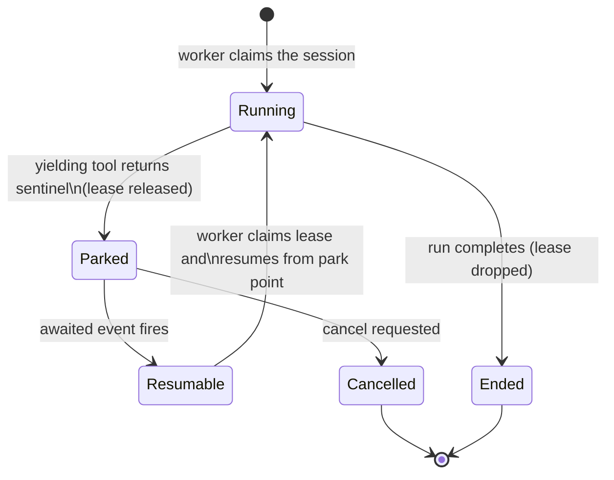
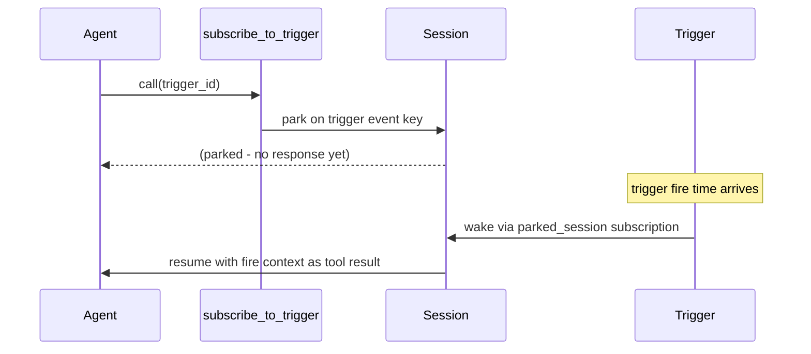

## What yielding is

Yielding tools are what make event-driven agentic AI possible on primer. They let a single agent wait on a real-world event (a human reply, a scheduled tick, a file change, an approval decision) for seconds, minutes, or days without holding a worker or a network connection open the whole time. This is the primitive behind long-lived agents that react to the world instead of running once and exiting: an agent can park on an event, wake when it fires, act, and park again, indefinitely. Without yielding, every wait would pin a worker for its full duration, and a handful of long-running agents would exhaust the platform.

Concretely, some tool calls are not instant computations. They are waits:

- `ask_user` waits for a person to type a reply.
- `subscribe_to_trigger` waits for a scheduled time or an incoming event.
- `sleep` waits for a duration.
- `watch_files` waits for a filesystem change.
- A tool approval gate waits for an operator decision.

If each waiting tool occupied a worker for its entire duration, a modest number of concurrent long-running waits would exhaust the worker pool. A system with ten workers and eleven sessions all waiting on user replies would leave the eleventh session unable to run any new work at all.

Yielding breaks that coupling. When a tool yields, it does not hold a worker while it waits. The session parks in durable storage, the worker is freed to handle other sessions, and the run resumes later when the awaited event fires.



The key insight is the gap between Parked and Resumable: during that window the run exists only in storage. No worker slot is consumed, no network connection is held. A parked session survives an arbitrary wait (seconds or hours) without resource cost.

## How a session parks and resumes

When a tool yields, it returns a sentinel value instead of a result. The runtime detects the sentinel and does three things atomically:

1. Writes the paused state (the in-progress message history, the tool name, and the event key the tool is waiting on) into durable storage.
2. Releases the worker lease, making the worker immediately available to claim other work.
3. Marks the session as parked.

Each yielding tool registers an event key when it parks. Common keys look like:

| Event key pattern | Yielding tool |
|---|---|
| `ask_user:{scope_id}:{call_id}` | `system__ask_user` |
| `trigger:{trigger_id}` | `workspace_ext__subscribe_to_trigger` |
| `tool_approval:{session_or_chat_id}:{call_id}` | Tool approval gate |
| `timer:{call_id}` | `workspace_ext__sleep` |
| `watch:{session_id}:{call_id}` | `workspace_ext__watch_files` |

When the awaited event fires (the user replies, the trigger ticks, the operator approves, the file changes), the platform publishes a message on that event key. The event listener picks it up, finds the matching parked row, and marks it resumable. From that moment the session is eligible to be claimed by any available worker.

When a worker claims the resumed session, it rehydrates the `ParkedState` blob (the LLM message history, the pending tool call id, and the yield resume metadata) and continues the turn from exactly where it stopped. To the LLM the park is invisible: the resumed turn sees the tool result it was waiting for and continues.

## Which tools yield

`ask_user` lives in the `system` toolset (chat-capable). The other four yielding tools (`sleep`, `watch_files`, `invoke_graph`, `subscribe_to_trigger`) live in the `workspace_ext` toolset and run only in workspace sessions; see the suppression note at the end of this section.

### `system__ask_user`

Asks the user (or the channel the session is bound to) a question and parks until a reply arrives. The reply is injected as the tool result. If no reply arrives within the configured timeout, the tool result indicates a timeout. If the operator cancels the yield via the console, the result indicates cancellation.

On a chat surface `ask_user` **soft-yields**: instead of parking the chat, it degrades to a conversational turn, asking the question as an ordinary assistant message and consuming the user's next reply as the tool result. In a workspace session it parks the session as described above.

Use `ask_user` when the agent needs a human decision before it can continue. Unlike `inform_user`, which sends a one-way message without parking, `ask_user` suspends the session entirely until a reply is received.

### `workspace_ext__sleep`

Parks the session for a fixed number of seconds (any value at or above 0, bounded by the global yield-timeout cap, which defaults to 60 minutes). A background sweeper publishes the timer event when the duration elapses. Zero-second sleeps short-circuit without parking. Fractional values are accepted.

Use `sleep` for polling loops, rate-limit backoffs, or any pattern where an agent must wait a known duration before retrying.

### `workspace_ext__subscribe_to_trigger`

Parks the session until a named trigger fires, then resumes with the fire context (trigger id, slug, kind, fired-at timestamp, and a deterministic fire id) as the tool result. The `parked_session` subscription that wakes the session is written before the park takes effect, so a trigger fire that races the park still finds the subscription and wakes the session correctly.

Use `subscribe_to_trigger` with a scheduled trigger to implement recurring agent work: the agent parks after each run, the trigger wakes it on the next cron tick, and the cycle repeats without a held connection.



### `workspace_ext__watch_files`

Parks the session until one or more workspace-relative paths change on disk. A background watcher polls file modification times and publishes a coalesced change burst on the event bus. On resume, the tool result carries a `changes` list where each entry includes the `path`, `event_type` (created / modified / deleted), and `mtime_after`.

Parameters:

| Parameter | Default | Description |
|---|---|---|
| `paths` | required | Workspace-relative paths to watch (files or directories; directories watch child files one level deep). Absolute paths and `..` segments are rejected. |
| `timeout_seconds` | none | Optional timeout; falls back to the global yield cap. On timeout the result is `{timed_out: true, changes: []}`. |
| `batch_window_ms` | 250 | After the first change is detected, the watcher waits this many milliseconds for more changes before publishing one coalesced burst. Increase for noisy file systems. |

Use `watch_files` when an agent must block until an external process writes or modifies a file in the workspace, for example waiting for a build output, a generated report, or another agent's write.

### `workspace_ext__invoke_graph`

Runs a named graph inside the current workspace session and returns its output text. The invoked graph's state nests under the calling session. This tool is classified as yielding because graph runs that involve human-in-the-loop steps (ask_user, tool approval gates) park the calling session while those gates are open.

Use `invoke_graph` when you need to delegate a self-contained multi-step workflow to a graph from within a session.

### The `workspace_ext` toolset and chat suppression

The four tools above (`sleep`, `watch_files`, `invoke_graph`, `subscribe_to_trigger`) live in the reserved `workspace_ext` toolset. It is **not** auto-registered: an agent binds `workspace_ext` explicitly on its Tools tab, the same way it binds any other toolset. But binding alone is not enough. These tools are registered with the model **only when the agent runs in a workspace session**. When the same agent is invoked on a **chat**, the `workspace_ext` tools are suppressed (not registered in the model's tool context) even though the toolset is bound. This keeps these heavy yielding tools (file watches, nested graph runs, multi-day trigger waits) out of chat context, where they have no workspace to act on and no park primitive to rely on. `ask_user` is the exception that is chat-capable, which is why it lives in `system`, not `workspace_ext`.

### Tool approval gates (a yield, not a tool)

A tool approval gate is the other yield you will encounter, but it is not a tool you call: it is raised by the dispatch layer whenever an active approval policy gates a call. The session parks on a `tool_approval:...` event key until an operator approves or rejects in the console. Because it is a yield, it composes with the tools above (a tool can both be approval-gated and yield for its own event). When an approval gate sits on a yielding tool the park is two-phase: the call first parks for the approval decision, and only once approved does the tool actually run and park again on its own event key (timer, file, graph, human). A rejection short-circuits to a clean error and the tool never runs. The full behavior, including how policies are configured and how approvals appear in the console, lives on the approvals page; it is not repeated here.

```ref:toolsets/toolsets-approvals
Configuring required, Rego, and LLM-judge approval policies, and how an approval parks and resumes a call.
```

```ref:workspaces/workspaces-and-sessions
The session lifecycle walkthrough, including how parked sessions appear in the console and the pending ask_user endpoint.
```

```ref:features/triggers
Creating triggers and subscriptions, and how subscribe_to_trigger parks a session.
```

```ref:toolsets/toolsets-system
The system and workspace_ext toolsets where yielding tools live.
```

```ref:features/workers
How the worker pool and claim engine pick up parked sessions when they become resumable.
```

## Configuration

Yielding tools do not require separate configuration. To make a tool available to an agent, add its toolset to the agent's tool list:

- `system__ask_user`: add the **system** toolset or select it as an individual tool. Works on both chats and workspace sessions (soft-yields on a chat).
- `workspace_ext__sleep`, `workspace_ext__watch_files`, `workspace_ext__invoke_graph`, `workspace_ext__subscribe_to_trigger`: add the **workspace_ext** toolset. These tools are registered only when the agent runs in a workspace session; they are suppressed when the agent is invoked on a chat.
- Tool approval policies: configure under the **Approvals** page; the gate is active for any session that calls the matching tool.

```embed:approvals
```

## Walkthrough: using ask_user in a session

1. Open **Agents** and create or edit an agent. On the tools tab, add the **system** toolset (or enable `ask_user` as an individual tool).
2. Open **Workspaces**, open a workspace, and start a new session bound to that agent.
3. Give the agent a task that it cannot complete without a human decision, for example: "Decide which of these two filenames you prefer and create the file."
4. Watch the session status. When the agent calls `ask_user`, the status changes to **Waiting**. The console shows the pending question.
5. Click the pending question in the session detail view and type a reply. Click **Send**.
6. The session status returns to **Running** as the agent receives the reply and continues its turn.

```embed:session-detail
```

```embed:sessions-list
```


```ref:features/workers
Worker pool capacity, the claim engine, and how parked sessions re-enter the queue.
```

```ref:reference/api-sessions
The API surface for the pending ask_user endpoint and the cancel-yield endpoint.
```
